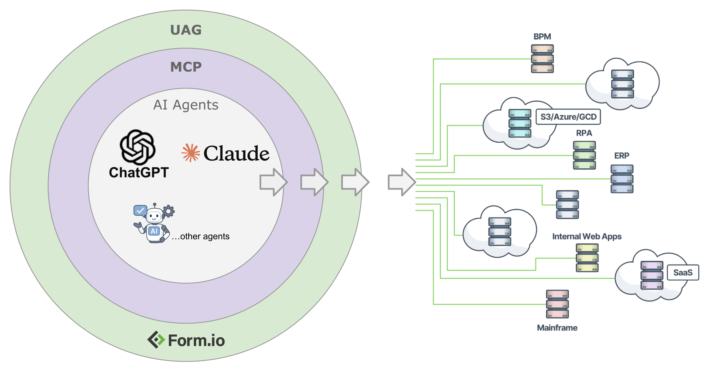
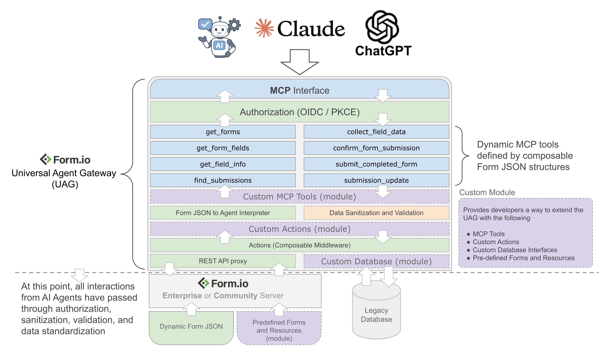
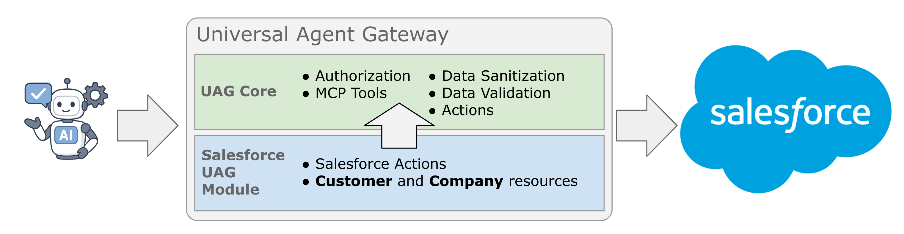

# The Form.io Universal Agent Gateway (UAG)
The Universal Agent Gateway (UAG) introduces the power of [Form.io](https://form.io) forms to AI agents.  

The Form.io UAG uses the [**Model Context Protocol (MCP)**](https://modelcontextprotocol.io/docs/getting-started/intro) to enable Form.io interaction through an AI agent workflow. By providing AI agents with the **dynamic context** of how to use Form.io JSON forms,  the UAG allows a user to interact with any aspect of their enterprise system served by the Form.io Platform directly through their AI agent.

---

## Table of Contents

- [The Form.io Universal Agent Gateway (UAG)](#the-formio-universal-agent-gateway-uag)
  - [Introduction](#introduction)  
    - [The Model Context Protocol (MCP)](#the-model-context-protocol-mcp)  
    - [Dynamic Context](#dynamic-context)  
    - [The Role of the UAG](#the-role-of-the-uag)  
  - [Technical Overview](#technical-overview)
    - [MCP Tools](#pre-defined-mcp-tools-providing-dynamic-context)
    - [Custom Modules](#custom-modules)
    - [Module Documentation](./module)
  - [Deploying UAG](#deploying-uag)
    - [Runtime Environments](#runtime-environments)
      - [Docker](#docker)
      - [Node.js (Express)](#nodejs-express)
    - [Environment Variables](#environment-variables)
    - [Running on Public Domain](#running-on-public-domain)
  - [Using with Form.io Enterprise Server](#using-with-formio-enterprise-server)

---

## Introduction
The core purpose of the UAG is to equip AI agents with the ability to forward a user's inputs to the Form.io platform. It allows the AI agent to apply natural language requests, scanned documents, and any other input it can parse into Form.io functionality, as defined by selected forms and fields.

  ### The Model Context Protocol (MCP)
  The Model Context Protocol (MCP) is an open-source standard for connecting AI applications to external systems.  

  The MCP essentially puts an AI agent's hands on the controls of an external system. In the case of Form.io, the MCP describes a discrete set of tools the AI agent can use to interact with forms, fields, and submissions. While some tools are delivered off-the-shelf, this functionality can be extended, modified, or refined through custom built modules.

  ### Dynamic Context
  What does it mean to say MCP provides a dynamic context for how to use these tools?

  The power of AI agents is their ability to parse free-form inputs, like natural language, and infer a user's intent rather than  take rote input like a command line. The dynamic context delivered by MCP gives the AI agent guidance on how to correlate the user's prompt to the tools and data available within Form.io. When the AI agent receives a prompt, it uses this dynamic context to determine what tool it should use, what elements of the prompt are inputs to that tool, and what additional input might be necessary. 

  ### The Role of the UAG
  The UAG is the package that contains everything sitting between the Form.io Platform and the AI agent.
  It contains the stock MCP server, the authorization infrastructure, and any custom tools or modules that extend the functionality.

  By equipping an AI agent with Form.io capabilities, the UAG brings the AI agent much deeper into the broader application ecosystem.  
  Form.io's drag-and-drop Form Builder simultaneously defines the look of the form and the structure of the data. This makes it easy to use data collected through Form.io forms elsewhere in an application or as an input to other enterprise systems.  
  
 
  When the UAG is able to map the freeform inputs that an AI agent receives to the data model defined by a form, it means that data can be quickly supplied to the enterprise tools that depend on the Form.io platform without additional interpretation or transformation.  
  This allows the UAG and Form.io to serve as a reliable middleware between an AI agent and countless other systems.

 The same role-based access control that governs all Form.io forms and submissions still applies to any interaction through the UAG. This addresses many potential issues some users may have with connecting AI agents to enterprise systems.

  Here is a visual graphic of the layers provided by the UAG to achieve a trusted and deterministic interface between AI Agents to external systems through the UAG + Form.io Server.

  

## Technical Overview
The UAG can be thought of as consisting of many layers of functionality. Each layer is broadly either serving to fetch dynamic context, or submit deterministic data structures. The following layers are leveraged within the UAG:

 1. **MCP Interface**:  The entry point of the UAG is the MCP interface that sits between the AI agent and the tools that are executed on the server.
 2. **Authorization**:  As part of the MCP specification, every interaction between the AI agent and the backend service must pass through an Authorization process leveraging OIDC (PKCE) authentication. The UAG takes this process one step further, however, by adding an OIDC (PKCE) authentication layer on top of the existing authentication flexibilities that Form.io already provides. Because of this, it is possible to authenticate with the UAG if you are using SAML, Form.io Authentication, OIDC, or even Custom Authentication processes through the Form.io platform.
 3. [**Pre-defined MCP Tools providing Dynamic Context**](#pre-defined-mcp-tools-providing-dynamic-context): The UAG utilizes the MCP to provide a number of pre-defined tools that provide AI agents with dynamic context based on the Forms and Resources marked as compatible within the Form.io platform. These tools are described in more detail in a section below.
 4. **Custom Tools** (provided by [Custom Modules](#custom-modules)): This enables developers to introduce any new tools that can leverage Form.io forms and submission data structures to provide additional capabilities introduced to the AI agents. This would allow for custom agent interactions to achieve certain goals for specific use cases.
 5. **Custom Actions** (provided by [Custom Modules](#custom-modules)): Enables developers to create composable middleware that will be executed once all data provided by the AI agent has been sanitized and validated. This provides the ability to interface the data collected from AI agents with any backend system or workflow.
 6. **Built-in Actions**: In addition to any custom actions introduced via a Module, the UAG supports a handful of existing Actions that can be assigned to any form or resource. Actions such as the **Webhook** that will send a REST API call to any endpoint once any submission has been made by an AI agent. This can be used to point to any serverless function to instigate backend workflows that are triggered from the interactions from AI agents.
 7. **Pre-defined Forms and Resources** (provided by [Custom Modules](#custom-modules)): Allows a developer to release a module that provides default data structures to the AI agent. This would be useful if a developer wishes to create a module that achieves a specific goal, where the data structures required for that goal need to follow a pre-determined set of fields provided by a form or resource. For example, if a developer wishes to release a CRM module for the UAG, then it would make sense that the module would also provide the default **Customer** and **Company** resources that commonly accompany most CRM implementations. 
 8. **Custom Database** (provided by [Custom Module](#custom-modules)): By default, the UAG performs the data collection and retrieval via a "Submission Proxy", whereas the data is submitted via REST API to either the Enterprise Server project or the Open Source server. This, however, could be modified to send the data directly to and from a Database. This can be achieved via the Database Interface provided from the UAG. For more information, see the **Module** documentation. This feature does require that the UAG is connected to the Enterprise Server.
   
Here is a diagram to understand how all of these layers are organized to make up the UAG.



### Pre-defined MCP Tools providing Dynamic Context
The following tools provided by the UAG can be described as follows:

| Tool Name       | Tool Description     |
|-----------------|----------------------|
| get_forms       | Provides the AI agent with a list of available forms. <br/>It will only return forms that have been tagged `uag`. |
| get_form_fields | When the AI agent infers the user intends to use a specific form, this tool provides the agent with a high level overview of all the fields needed (along with the field data path) to submit that form. |
| get_field_info | Once the fields have been determined using `get_form_fields`, this tool provides specific information about the requested fields, such as validation, conditionals, input formats, etc. <br/>This tool instructs the AI agent on how to format and structure the data that is sent to the MCP server. |
| collect_field_data  | Provides the AI agent with a mechanism to dynamically collect the required information from the user. It can parse the user's input into multiple fields at once, and will identify additional inputs from the user if needed. <br/>This tool supports complex and structured data collection and is compatible with nested or multi-value fields like nested forms, data grids, etc.       |
| confirm_form_submission     | When the AI agent is ready to submit a form, this tool allows it to confirm all the information it has collected before a submission has been made to the form. |
| submit_completed_form    | Provides the AI agent with the ability to submit all of the data collected from the user to create the form submission. |
| find_submissions | Enables the agent to parse a user's natural language request into a query for a submission, or a specific field of a particular submission. |
| submission_update | Provides the AI agent with the ability to update an existing submission, either by supplying unfilled fields or updating existing ones if allowed. Provides the AI agent with the context of the existing field values, allowing inline changes or edits. | 

### Custom Modules
While the UAG can be used as a stand-alone system to enable the interaction between AI agents and dynamic JSON forms, the true power of this platform will be realized when developers extend the capabilities of this platform to solve industry specific use cases through the use of Custom Modules and Tools. It is possible for a developer to create a **Module** that introduces a number of custom tools, actions, and pre-defined resources and forms to achieve interactions with industry specific technologies.

For example, by creating a UAG Module for Salesforce, you can produce a system that can dynamically provide Customer and Company resource data structures to any AI agent, and then through the use of Custom Actions, you can integrate that structured data directly to Salesforce via their own API's as the following image illustrates.

<sub>This is just an example.</sub>


Custom modules are able to achieve this custom integration capabilities through the use of the following mechanisms:

 1. **Pre-defined Form and Resources**: Using the Form.io template system, a custom module can include a template export of a Form.io project that includes a number of Forms, Resources, and Actions (as well as any Roles and Permissions associated with them). By using the module, this will then automatically "register" these assets so that the AI agent is immediately aware of those assets.  
 For example, imagine a module includes a Customer resource with "First Name", "Last Name", and "Email" fields. If you then simply ask an AI agent, "I would like to add a new Customer" the agent will automatically be aware of the context for the customer data structures and know exactly what your intent is when making that request.
 2. **Custom Actions**: Actions can be thought of as composable middleware functions that allow for configurable Express.js middleware functions to be attached to any Form and Resource, and then to be executed once the data being submitted by an AI agent has passed through the proper data validations and sanitization. These can be used to provide custom integrations to backend processes and workflows.
 3. **Custom Tools**: In addition to providing custom actions, a Module can also introduce custom MCP Tools to provide bespoke interaction capabilities between the UAG and the AI agents for any industry specific purposes.
 4. **Custom Authentication**: A module can also modify the "authentication" landing page to assist with any custom requirements that are needed around Authentication. 
 5. **Behavior Overrides**: A module also has the ability to "override" any default behavior from the UAG. This ensures that whomever is using a certain module can "tweak" certain tools and responses to achieve better results as it pertains their their industry specific needs.

Form.io aims to enable developers to build and contribute their own custom modules to the broader community through GitHub and NPM. For example, once these modules proliferate, it may be possible to install the salesforce module for UAG with the following.

<sub>This is just an example.</sub>
```
npm install salesforce-uag
```

and then use it as follows.

<sub>This is just an example.</sub>
```js
import { UAGServer } from '@formio/uag';
import { SalesforceUAG } from 'salesforce-uag';
import Express from 'express';
try {
    (async function () {
        const server = new UAGServer();
        server.use(SalesforceUAG);
        const app = Express();
        app.use(await server.router());
        const port = process.env.PORT || 3200;
        app.listen(port, () => {
            console.log(`Form.io UAG server running on port ${port}`);
            console.log(`Visit http://localhost:${port} to access the application`);
        });
    })();
} catch (error) {
    console.error('Failed to start server:', error);
    process.exit(1);
}
```

To get started in building your own custom module, go to the help documentation at [Modules Readme](./module/Readme.md).

## Deploying UAG
The following sections describe the process of creating a running instance of UAG, connecting it to the Form.io Platform, and configuring an AI agent to use it.

This documentation focuses on using UAG with Form.io Open Source. For documentation on using UAG with Form.io Enterprise, refer to [Help.Form.io/UAG](https://help.form.io/uag).

### Local Example
The quickest way to become familiar with the UAG is to first walk through our Local Example, which will spin up a local instance of Form.io Open Source and UAG. This can then be connected to an AI agent, which will have the ability to interact with the included example forms. The local example can be run entirely free, with no trial or license required.

**[Go to Local Example &raquo;](examples/local)**

### Runtime Environments
There are currently two run-time environments that work with the UAG:
 -[**Docker**](#docker)
 -[**Node.js (Express)**](#nodejs-express)


### Docker
Running the UAG in Docker enables a wide range of deployment options into common hosting environments such as AWS and Azure. Additionally, it allows for the use of common orchestration runtimes such as Kubernetes and Docker Compose. The container that you will run the UAG is as follows:

```
formio/uag
```

This container can be run in two ways:  
  - [**Docker-Compose.yml**](#docker-compose-recommended) - The recommended method, deploys with of a Docker Compose multicontainer.
  - [**Docker Run**](#docker-run) - a standalone container using the common `docker run` command.


#### Docker Compose (Recommended)
The recommended way to launching the UAG is through Docker Compose. This enables you to orchestrate several of the containers to run within a single instance to provide a more seamless and simple way of managing your deployments. Here is a simple example of how to run both the Form.io UAG + Form.io OSS server on the same instance.

docker-compose.yml
```
version: "3.8"
services:
  mongo:
    image: mongo
    restart: always
    volumes:
      - ./data/db:/data/db
    environment:
      - MONGO_INITDB_ROOT_USERNAME
      - MONGO_INITDB_ROOT_PASSWORD
  formio:
    image: formio/formio:rc
    restart: always
    links:
      - mongo
    depends_on:
      - mongo
    environment:
      PORT: 3000
      DEBUG: formio.*
      NODE_CONFIG: '{"mongo": "mongodb://mongo:27017/formio-oss", "jwt": {"secret": "CHANGEME"}, "mongoSecret": "CHANGEME"}'
      ROOT_EMAIL: admin@example.com
      ROOT_PASSWORD: CHANGEME
      ADMIN_KEY: CHANGEME
    ports:
      - "3000:3000"
  formio-uag:
    image: formio/uag
    restart: always
    links:
      - formio
    depends_on:
      - formio
    environment:
      PORT: 3200
      DEBUG: formio.*
      PROJECT: http://formio:3000
      ADMIN_KEY: CHANGEME
      JWT_SECRET: CHANGEME
      JWT_EXPIRE_TIME: 525600
      LOGIN_FORM: http://localhost:3000/employee/login
      BASE_URL: http://localhost:3000
    ports:
      - "3200:3200"
```

This can be run by typing the following...

```
docker compose up -d
```

#### Docker Run
Here are some examples of running the UAG using the ```docker run``` command.

**UAG pointed to an Open Source server**
```
docker run -d \
  -e "PROJECT=https://forms.mysite.com" \
  -e "ADMIN_KEY=CHANGEME" \
  -e "JWT_SECRET=CHANGEME" \
  -e "BASE_URL=https://forms.mysite.com" \
  -e "LOGIN_FORM=https://forms.mysite.com/user/login" \
  -e "PORT=3200" \
  --restart unless-stopped \
  --network formio \
  --name formio-uag \
  -p 3200:3200 \
  formio/uag
```

**UAG pointed to an Form.io Enterprise Server**
```
docker run -d \
  -e "PROJECT=https://forms.mysite.com/myproject" \
  -e "PROJECT_KEY=CHANGEME" \
  -e "UAG_LICENSE=YOUR-LICENSE" \
  -e "JWT_SECRET=CHANGEME" \
  -e "PORTAL_SECRET=CHANGEME" \
  -e "BASE_URL=https://forms.mysite.com" \
  -e "LOGIN_FORM=https://forms.mysite.com/myproject/user/login" \
  -e "PORT=3200" \
  --restart unless-stopped \
  --network formio \
  --name formio-uag \
  -p 3200:3200 \
  formio/uag
```

Once it is running, you can then navigate to the following to access both the OSS Deployment + UAG Server
 - http://localhost:3000:  The Form.io OSS Server
 - http://localhost:3200:  The UAG Server

In both the Node.js runtime environmnt as well as Docker, the way to control the UAG is through the use of **Environment Variables** and **Modules**.

### Environment Variables
This module can be configured in many ways. One of those ways is through the use of Environment Variables, which are documented as follows.

| Variable | Description | Example |
|----------|-------------|---------|
| PROJECT | The API Endpoint to either an Enterprise project endpoint, or the OSS server url. | http://localhost:3000 |
| PROJECT_KEY | (Enterprise Only) Either a Project API Key (for Form.io Enterprise) or the ADMIN_KEY for Open Source. | CHANGEME |
| ADMIN_KEY | (Open Source Only) Allows you to provide the ADMIN_KEY to install and connect to the OSS Server. | CHANGEME |
| UAG_LICENSE | The license to run the UAG against a Form.io Enterprise Deployment. | |
| PROJECT_TTL | The project cache TTL in seconds. This controls the amount of time to check for any "changes" that have been made to the project to refresh any forms and resources within the UAG. | 900 |
| PORT | The port you wish to run the server on. | 3200 |
| DEBUG | Variable used to perform debug logs of server activity | formio.* |
| PORTAL_SECRET | Enterprise Only:  Allows you to connect to the UAG from the Form.io Enterprise Portal. | CHANGEME |
| JWT_SECRET | A secret used to generate and validate JWT tokens generated through the authentication process of the UAG. This does not need to match the JWT_SECRET of the Enterprise Server that it is connected to. | CHANGEME |
| JWT_EXPIRE_TIME | The expiration for the jwt secret. | 3600 |
| MONGO | (Enterprise Only) Allows you to connect the UAG directly to a mongo database, rather than having to redirect the submissions to the Form.io Submission APIs. | |
| MONGO_CONFIG | JSON configuration for the Node.js Mongo Driver. | |
| BASE_URL | The public URL that the UAG is hosted on. This allows for proper OIDC authentication and allows for the authentication callbacks to point to the correct url. | https://forms.yoursite.com |
| LOGIN_FORM | The public URL to the Login Form JSON endpoint. | https://mysite.com/project/user/login |
| CORS | The cors domain, or the JSON configuration to configure the "cors" node.js module cross domain resource sharing. | *.* |

### Project Cache and TTL
By default, the UAG uses a TTL to "fetch" any of the project assets and register them and cache them into the UAG. What this means is that if you make any changes to your underlying project forms and resources (either directly or through a deployment), you need to wait a maximum of the TTL setting (in seconds) to see any updates that have been made. For example, if the TTL is set to 900 (or 15 minutes), and you make a change to any forms and resources, you must wait at most 15 minutes to see any of these changes take effect into the UAG. It should be noted that when a "refresh" occurs, an API call to the "export" method is called on the underlying project endpoint. This is a processor intensive API call, so it is not recommended to set the TTL to any value less than 60.  A value of 0 is interpreted as "No TTL", which means the only way to refresh the project forms and resourcs, a UAG reboot is necessary.

Here is a table explaining how this parameter can be used.

| Environment Variable | Value | Result |
|----------|-------------|---------|
| PROJECT_TTL | 0 | No TTL (refresh) will occur.  This can be used to "disable" any refresh and ensure the ONLY way to refetch updated forms and resources, you must reboot the UAG server. |
| PROJECT_TTL | 60 | Check for changes every minute |
| PROJECT_TTL | 3600 | Check for changes every hour |

### Running on Public Domain
In order to run the UAG on a public domain, it is very important to provide the proper configurations so that any AI agent can properly authenticate. There are 3 different "domain" environment variables that matter, and it is important to understand how to configure them depending on your use case:

#### PROJECT
The ```PROJECT``` environment variable is used to establish a connection from the UAG server to the project endpoint (for Enterprise) or OSS base url. This does NOT need to be a public DNS entry, but rather a URL that connects the UAG container to the Server container.  The following examples illustrate how this would be configured.

##### Local connection to OSS Server
If you are using a local connection, such as within a Docker Compose file, you can configure the ```PROJECT``` environment variable to point directly to the local url as follows.

docker-compose.yml
```
version: "3.8"
services:
  formio:
    image: formio/formio:rc
    restart: always
    environment:
      PORT: 3000
      ADMIN_KEY: CHANGEME
  formio-uag:
    image: formio/uag
    restart: always
    links:
      - formio
    depends_on:
      - formio
    environment:
      PROJECT: http://formio:3000
      ADMIN_KEY: CHANGEME
```

In this example, we have Docker Compose launching the OSS Form.io container with the ADMIN_KEY set for this deployment, the UAG is connected using ```http://formio:3000``` which is the local Docker network name (provided using the "links" property in the docker compose file).

##### Local Connection to Enterprise Server Project
If you are using the Enterprise Form.io server within a local environment to the UAG, then you will need to ensure that the UAG connects to an independent project using the PROJECT_KEY as follows.

docker-compose.yml
```
version: "3.8"
services:
  formio-enterprise:
    image: formio/formio-enterprise
    restart: always
    environment:
      PORT: 3000
  formio-uag:
    image: formio/uag
    restart: always
    links:
      - formio-enterprise
    depends_on:
      - formio-enterprise
    environment:
      PROJECT: http://formio-enterprise:3000/myproject
      PROJECT_KEY: CHANGEME
```

##### Public DNS
If your project does not reside on the same network as the UAG, you can provide the domain name as the PROJECT as follows.

docker-compose.yml: Connected to Enterprise (formio/formio-enterprise)
```
version: "3.8"
services:
  formio-uag:
    image: formio/uag
    restart: always
    environment:
      PROJECT: https://forms.mydomain.com/myproject
      PROJECT_KEY: CHANGEME
```

docker-compose.yml: Connected to Open Source (formio/formio)
```
version: "3.8"
services:
  formio-uag:
    image: formio/uag
    restart: always
    environment:
      PROJECT: https://forms.mydomain.com
      ADMIN_KEY: CHANGEME
```

#### BASE_URL
The ```BASE_URL``` is used to communicate to the AI agent the public domain that is hosting the UAG server. This value is provided within the ```.well-known``` definitions for the OIDC (PKCE) authentication. If this is not correct, then the AI agent will not be able to authenticate into the UAG.

**This needs to be the publicly accessible domain that you are hosting your UAG.**

For example, ```BASE_URL: https://forms.mysite.com```.

#### LOGIN_FORM
This is the publicly accessible URL to the Login form of your Project or OSS deployment. This provides the URL that is loaded when the user navigates to ```{{ BASE_URL }}/auth/authorize```.  If you navigate to this URL, and the page says that you cannot load the form, then this is because your LOGIN_FORM environment variable is not pointing to the correct form JSON endpoint of your project. 

For example:
 - Enterprise Example: ```LOGIN_FORM: https://forms.mysite.com/myproject/user/login```
 - OSS Example:  ```LOGIN_FORM: https://forms.mysite.com/user/login```

### Node.js (Express):
With the Node.js environment, you can import the UAG within a locally running Node.js and Express.js environment. This works by first importing the UAG module and "use"ing it within an Express.js application. First, you will install the UAG inside of your Node.js Express application like the following.

```npm install --save @formio/uag```

or

```yarn add @formio/uag```

You can then mount the UAG within your Express application, as seen in the following example:

```js
import 'dotenv/config';
import Express from 'express';
import { UAGServer } from '@formio/uag';
try {
    (async function () {
        const server = new UAGServer();
        const app = Express();
        app.use(await server.router());
        const port = process.env.PORT || 3200;
        app.listen(port, () => {
            console.log(`Form.io UAG server running on port ${port}`);
            console.log(`Visit http://localhost:${port} to access the application`);
        });
    })();
} catch (error) {
    console.error('Failed to start server:', error);
    process.exit(1);
}
```

There is also a way to extend the functionality of the UAG through the use of modules, which is documented in the [Modules Readme](./module/Readme.md)

## Using with Form.io Enterprise Server
When using the UAG with the Form.io Enterprise Server, you unlock several benefits with regards to managing the Forms and Resources within the UAG. Some of the features that you gain with our Enterprise Server include:

 - **Form Revisions** - Our form revision system provides a way to keep track of any changes made to any forms, and associate those changes with the submission data that is submitted against those revisions. This feature enables you to ensure that if any form schemas change, that the data submitted for that form correlates with the revision of the form in which it was submitted. In addition to this powerful feature, you can also leverage Form Revisions as a method to "roll-back" any mistakes or regressions caused by form changes. Instead of having to re-train or un-train an AI agent with any schema, you simply revert to previous revisions and the AI agent will adjust accordingly.
 - **Submission Revisions** - Submission revisions provides a way to keep track of any data changes that have been made to a submission and provides information on who changed the data. This combined with the power of the UAG provides any system the ability to audit any changes in data made by both AI agents as well as humans in the workflow processes.
 - **Stage Versions and Deployments** - Stage versions provides a way to create a "tag" version across all forms and resources within a project. This ensures that you can stamp a point in time where your AI agent (which may consume many different forms and resources) interfaces with your whole project in a deterministic way. It also provides a much more elegant "roll-back" mechanism where the entire project of forms and resources can be versioned and deployed independently.

### Running the UAG against the Enterprise Server
In order to run the UAG against an Enterprise Server, you need to provide a few Environment variables that are different from the OSS runtime of this module. The following environment variables are required to run against an Enterprise Project.

| Variable | Description | Example |
|----------|-------------|---------|
| PROJECT | For the Enterprise Server, this points to the Project Endpoint you wish to bind the UAG to. | https://mydeployment.com/myproject |
| PROJECT_KEY | An API Key for that project, provided within the Project Settings | CHANGEME |
| UAG_LICENSE | This is the license provided to you from the Form.io License team. Contact support@form.io to acquire a "temporary" or full license. | |

Once you have these environment variables in place, you should be able to run the UAG pointed to your Enterprise Project.

