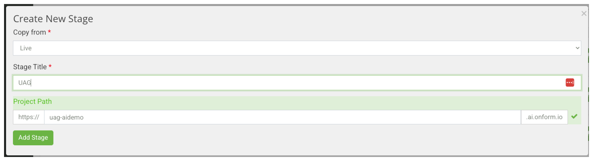
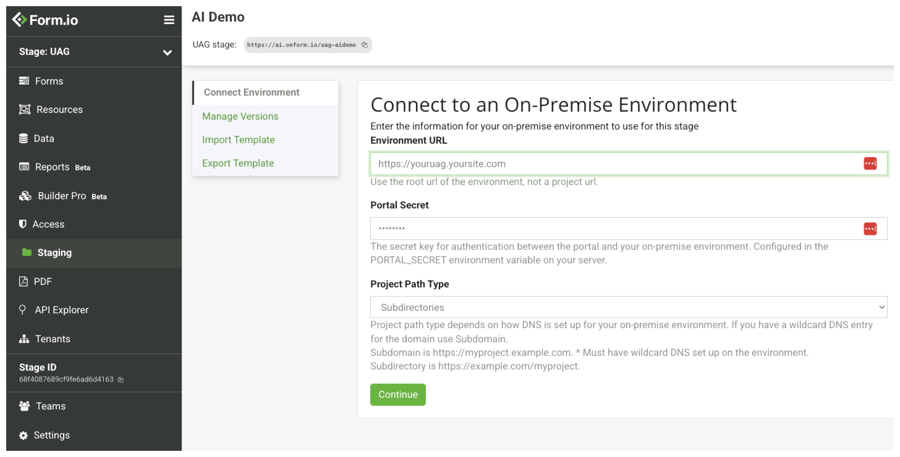

# The Form.io "Universal Agent Gateway" (UAG)
The Universal Agent Gateway (uag) is an exciting new technology that enables the exposure of Form.io forms to AI Agents. Leveraging the power of MCP, this library provides AI Agents with dynamic context of how to interface with any backend system using Form.io JSON Forms as the common language between these agents and enterprise systems. 

This library can be used in many ways, either by deploying it directly via the Docker container, or by extending the interfaces and introducing your own custom Actions and providers.

## How it works
The UAG introduces a number of new tools through the MCP interface to provide an AI Agent with dynamic "form" based context on a per form basis. This cabability allows for Developers to treat AI Agents as they would any other Human who is submitting a form, and ensure that the AI Agents stay "on the rails" without requiring extensive domain specific agent training methods to accomplish the same goal. It achieves this by exposing the following MCP tools to an AI Agent.

| Tool Name         | Tool Description                                                                 |
|-------------------|----------------------------------------------------------------------------------|
| get_forms       | Provides the AI Agent an understanding of what Forms are available. It will only return forms that have a tag of "uag". |
| get_form_fields     | Once a form has been identified by the AI Agent that the user wishes to engage with (using natural language), this tool provides the AI Agent information of all the fields needed (along with the field data path) to submit that form.            |
| collect_field_data  | This tool provides the AI Agent a mechanism to dynamically collect the required information from the user. It is capable of collecting many fields at once, and also provides the AI agent the ability to understand what required fields are missing and what is needed to complete its goal.        |
| confirm_form_submission     | This tool provides the AI Agent the ability to confirm all the information it has collected before a submission has been made. It allows the AI Agent the ability to get a confirmation from the user before it submits the form. |
| submit_completed_form    | This tool provides the AI Agent the ability to submit all of the data collected from the user to complete the form submission.
| find_submissions | A very powerful tool that provides the AI Agent the ability to understand how to query for data within the form. This enables the user to say something like "What is the email address of Joe Smith who is the CTO of Microsoft?" and it will format the query responsible for finding that record within the Form.io database.
| submission_update | Provides the AI agent the ability to update an existing record with any additional information. This also has the awareness to "append", "prepend", and perform any other operations on the data in congruence with how the user has requested the data be updated. 

## Getting Started
The quickest way to become familar with the UAG is to first walk through our Local Example, and run it on your local machine. This will allow you to see how the UAG leverages the power of Form.io to connect with an AI Agent to provide dynamic context. All of this can be ran locally for free without any subscriptions required!

**[Go to Local Example &raquo;](examples/local)**

## Runtime Environments
There are two environments that you can current run and work with the UAG.

### Node.js (Express):
With the Node.js environment, you can import the UAG within a locally running Node.js and Express.js envioronment. This works by first importing the UAG module and "use"ing it within an Express.js application. First, you will install the uag inside of your Node.js Express application like the following.

```npm install --save @formio/uag```

or

```yarn add @formio/uag```

You can then mount the UAG within your Express application like the following example shows.

```js
import 'dotenv/config';
import Express from 'express';
import { UAGServer } from '@formio/uag';
try {
    (async function () {
        const server = new UAGServer();
        const app = Express();
        app.use(await server.router());
        const port = process.env.PORT || 3200;
        app.listen(port, () => {
            console.log(`Form.io UAG server running on port ${port}`);
            console.log(`Visit http://localhost:${port} to access the application`);
        });
    })();
} catch (error) {
    console.error('Failed to start server:', error);
    process.exit(1);
}
```

There is also a way to extend the functionality of the UAG through the use of modules, which is documented in the [Modules Readme](./module/Readme.md)

### Docker
In addition to running the UAG in node.js, you can also run the UAG within the Docker environment. This enables a wide range of deployment options into common hosting environments such as AWS and Azure as well as allow for the use in common orchestration runtimes such as Kubernetes and Docker Compose. The container that you will use for running the UAG is as follows.

```
formio/uag
```

This container can be ran as a standalone container using the common **docker run** command, or inside of a **docker-compose.yml** (for Docker Compose). To see an example of using UAG with Docker Compose, we recommend taking a look at the [Local Example](./examples/local). 

#### Docker Run
Here are some examples of running the UAG using the ```docker run``` command.

**UAG pointed to an Open Source server**
```
docker run -d \
  -e "PROJECT=https://forms.mysite.com" \
  -e "ADMIN_KEY=CHANGEME" \
  -e "JWT_SECRET=CHANGEME" \
  -e "BASE_URL=https://forms.mysite.com" \
  -e "LOGIN_FORM=https://forms.mysite.com/user/login" \
  -e "PORT=3200" \
  --restart unless-stopped \
  --network formio \
  --name formio-uag \
  -p 3200:3200 \
  formio/uag:rc
```

**UAG pointed to an Form.io Enterprise Server**
```
docker run -d \
  -e "PROJECT=https://forms.mysite.com/myproject" \
  -e "PROJECT_KEY=CHANGEME" \
  -e "UAG_LICENSE=YOUR-LICENSE" \
  -e "JWT_SECRET=CHANGEME" \
  -e "PORTAL_SECRET=CHANGEME" \
  -e "BASE_URL=https://forms.mysite.com" \
  -e "LOGIN_FORM=https://forms.mysite.com/myproject/user/login" \
  -e "PORT=3200" \
  --restart unless-stopped \
  --network formio \
  --name formio-uag \
  -p 3200:3200 \
  formio/uag:rc
```

### Docker Compose (Recommended)
The recommended way to launching the UAG is through Docker Compose. This enables you to orchestrate several of the containers to run within a single instance to provide a more seamless and simple way of managing your deployments. Here is a simple example of how to run both the Form.io UAG + Form.io OSS server on the same instance.

docker-compose.yml
```
version: "3.8"
services:
  mongo:
    image: mongo
    restart: always
    volumes:
      - ./data/db:/data/db
    environment:
      - MONGO_INITDB_ROOT_USERNAME
      - MONGO_INITDB_ROOT_PASSWORD
  formio:
    image: formio/formio:rc
    restart: always
    links:
      - mongo
    depends_on:
      - mongo
    environment:
      PORT: 3000
      DEBUG: formio.*
      NODE_CONFIG: '{"mongo": "mongodb://mongo:27017/formio-oss", "jwt": {"secret": "CHANGEME"}, "mongoSecret": "CHANGEME"}'
      ROOT_EMAIL: admin@example.com
      ROOT_PASSWORD: CHANGEME
      ADMIN_KEY: CHANGEME
    ports:
      - "3000:3000"
  formio-uag:
    image: formio/uag:rc
    restart: always
    links:
      - formio
    depends_on:
      - formio
    environment:
      PORT: 3200
      DEBUG: formio.*
      PROJECT: http://formio:3000
      ADMIN_KEY: CHANGEME
      JWT_SECRET: CHANGEME
      JWT_EXPIRE_TIME: 525600
      LOGIN_FORM: http://localhost:3000/employee/login
      BASE_URL: http://localhost:3000
    ports:
      - "3200:3200"
```

This can be run by typing the following...

```
docker compose up -d
```

Once it is running, you can then navigate to the following to access both the OSS Deployment + UAG Server
 - http://localhost:3000:  The Form.io OSS Server
 - http://localhost:3200:  The UAG Server

In both the Node.js runtime environemnt as well as Docker, the way to control the UAG is thorugh the use of **Environment Variables** and **Modules**.

### Environment Variables
This module can be configured in many ways. One of those ways is through the use of Environment Variables, which are documented as follows.

| Variable | Description | Example |
|----------|-------------|---------|
| PROJECT | The API Endpoint to either an Enterprise project endpoint, or the OSS server url. | http://localhost:3000 |
| PROJECT_KEY | (Enterprise Only) Either a Project API Key (for Form.io Enterprise) or the ADMIN_KEY for Community Edition. | CHANGEME |
| ADMIN_KEY | (OSS Only) Allows you to provide the ADMIN_KEY to install and connect to the OSS Server. | CHANGEME |
| UAG_LICENSE | The license to run the UAG against a Form.io Enterprise Deployment. | |
| PORT | The port you wish to run the server on. | 3200 |
| DEBUG | Variable used to perform debug logs of server activity | formio.* |
| PORTAL_SECRET | Enterprise Only:  Allows you to connect to the UAG from the Form.io Enterprise Portal. | CHANGEME |
| JWT_SECRET | A secret used to generate and validate JWT tokens generated through the authentication process of the UAG. This does not need to match the JWT_SECRET of the Enterprise Server that it is connected to. | CHANGEME |
| PORTAL_SECRET | (Enterprise Only) Used to connect the UAG server with the Enterprise Portal | CHANGEME |
| JWT_EXPIRE_TIME | The expiration for the jwt secret. | 3600 |
| MONGO | (Enterprise Only) Allows you to connect the UAG directly to a mongo database vs. having to redirect the submissions to the Form.io Submission APIs. | |
| MONGO_CONFIG | JSON configuration for the Node.js Mongo Driver. | |
| BASE_URL | The public URL that the UAG is hosted on. This allows for proper OIDC authentication and allows for the authentication callbacks to point to the correct url. | https://ai.onform.io |
| LOGIN_FORM | The public URL to the Login Form JSON endpoint. | https://mysite.com/project/user/login |
| CORS | The cors domain, or the JSON configuration to configure the "cors" node.js module cross domain resource sharing. | *.* |

## Running on Public Domain
In order to run the UAG on a public domain, it is very important to provide the proper configurations so that any AI Agent can properly authenticate. There are 3 different "domain" environment variables that matter, and it is important to understand how to configure them depending on your use case:

### PROJECT
The ```PROJECT``` environment variable is used to establish a connetion from the UAG server to the project endpoint (for Enterprise) or OSS base url. This does NOT need to be a public DNS entry, but rather a URL that connects the UAG container to the Server container.  The following examples illustrate how this would be configured.

#### Local connection to OSS Server
If you are using a local connection, such as within a Docker Compose file, you can configure the ```PROJECT``` environment variable to point directly to the local url as follows.

docker-compose.yml
```
version: "3.8"
services:
  formio:
    image: formio/formio:rc
    restart: always
    environment:
      PORT: 3000
      ADMIN_KEY: CHANGEME
  formio-uag:
    image: formio/uag:rc
    restart: always
    links:
      - formio
    depends_on:
      - formio
    environment:
      PROJECT: http://formio:3000
      ADMIN_KEY: CHANGEME
```

In this example, we have Docker Compose launching the OSS Form.io container with the ADMIN_KEY set for this deployment, the UAG is connected using ```http://formio:3000``` which is the local Docker network name (provided using the "links" property in the docker compose file)

#### Local Connection to Enterprise Server Project
If you are using the Enterprise Form.io server within a local environment to the UAG, then you will need to ensure that the UAG connects to an independent project using the PROJECT_KEY as follows.

docker-compose.yml
```
version: "3.8"
services:
  formio-enterprise:
    image: formio/formio-enterprise
    restart: always
    environment:
      PORT: 3000
  formio-uag:
    image: formio/uag:rc
    restart: always
    links:
      - formio-enterprise
    depends_on:
      - formio-enterprise
    environment:
      PROJECT: http://formio-enterprise:3000/myproject
      PROJECT_KEY: CHANGEME
```

#### Public DNS
If your project does not reside on the same network as the UAG, you can provide the domain name as the PROJECT as follows.

docker-compose.yml: Connected to Enterprise (formio/formio-enterprise)
```
version: "3.8"
services:
  formio-uag:
    image: formio/uag:rc
    restart: always
    environment:
      PROJECT: https://forms.mydomain.com/myproject
      PROJECT_KEY: CHANGEME
```

docker-compose.yml: Connected to Open Source (formio/formio)
```
version: "3.8"
services:
  formio-uag:
    image: formio/uag:rc
    restart: always
    environment:
      PROJECT: https://forms.mydomain.com
      ADMIN_KEY: CHANGEME
```

### BASE_URL
The ```BASE_URL``` is used to communicate to the AI Agent the public domain that is hosting the UAG server. This value is provided within the ```.well-known``` definitions for the OIDC (PKCE) authentication. If this is not correct, then the AI Agent will not be able to authenticate into the UAG.

**This needs to be the publically accessible domain that you are hosting your UAG.**

For example, ```BASE_URL: https://forms.mysite.com```.

### LOGIN_FORM
This is the publically accessible URL to the Login form of your Project or OSS deployment. This provides the URL that is loaded when the user navigates to ```{{ BASE_URL }}/auth/authorize```.  If you navigate to this URL, and the page says that you cannot load the form, then this is because your LOGIN_FORM environment variable is not pointing to the correct form JSON endpoint of your project. 

For example:
 - Enterprise Example: ```LOGIN_FORM: https://forms.mysite.com/myproject/user/login```
 - OSS Example:  ```LOGIN_FORM: https://forms.mysite.com/user/login```

## Modules
One of the more powerful ways to "control" and extend the UAG is through the use of Modules. This allows you to provide custom Resources, Forms, as well as custom actions and configurations to ensure that the UAG behaves exactly as you wish for it to behave for your use case.

Extensive documentation for the UAG Module system can be found in the [Modules Readme](./module/Readme.md).

## Using with Form.io Enterprise Server
If you are using the UAG with the Form.io Enterprise Server, you unlock several benefits with regards to managing the Forms and Resources within the UAG. Some of the features that you gain with our Enterprise Server are as follows:

 - **Form Revisions** - Our form revision system provides a way to keep track of any changes made to any forms, and associate those changes with the submission data that is submitted against those revisions. This feature enables you to ensure that if any form schemas change, that the data submitted for that form correlates with the revision of the form in which it was submitted. In addition to this powerful feature, you can also leverage Form Revisions as a method to "roll-back" any mistakes or regressions caused by form changes. Instead of having to re-train or un-train an AI Agent with any schema, you simply revert to previous revisions and the AI Agent will adjust accordingly.
 - **Submission Revisions** - Submission revisions provides a way to keep track of any data changes that have been made to a submission and provides information on who changed the data. This combined with the power of the UAG provides any system the ability to audit any changes in data made by both AI Agents as well as humans in the workflow processes.
 - **Stage Versions and Deployments** - Stage versions provides a way to create a "tag" version accross all forms and resources within a project. This ensures that you can stamp a point in time where your AI Agent (which may consume many different forms and resources) interfaces with your whole project in a deterministic way. It also provides a much more elegant "roll-back" mechansism where the entire project of forms and resources can be versioned and deployed independently.
 - **Custom Actions** - Through the use of the Developer Portal and remote connections, you can use the Actions UI to manage and configure any custom actions that are configured within your UAG. Once a custom action is registered, via the **Modules** system, you can add that action to a form and configure it using the Form.io Developer Portal.

### Running the UAG against the Enterprise Server
In order to run the UAG against an Enterprise Server, you need to provide a few Environment variables that are different from the OSS runtime of this module. The following environment variables are required to run against an Enterprise Project.

| Variable | Description | Example |
|----------|-------------|---------|
| PROJECT | For the Enterprise Server, this points to the Project Endpoint you wish to bind the UAG to. | https://mydeployment.com/myproject |
| PROJECT_KEY | An API Key for that project, provided within the Project Settings | CHANGEME |
| UAG_LICENSE | This is the licnese provided to you from the Form.io License team. Contact support@form.io to acquire a "temporary" or full license. | |
| PORTAL_SECRET | This enables you to "connect" your Form.io Developer Portal to the UAG so that you can view any custom actions as well as perform deployments to the UAG. | |

Once you have these environment variables in place, you should be able to run the UAG pointed to your Enterprise Project. You can now connect to this UAG from the Developer Portal as follows.

### Connecting your Developer Portal to the UAG.
Once you have the UAG running in your own environment with a PORTAL_SECRET, you will now create a new Stage within your Developer portal. We can call this UAG.

<div align="center">
  
</div>

Next, you will click on **Staging** and then connect to your UAG server by providing the PORTAL_SECRET as follows.

<div align="center">
  
</div>

Now that the UAG is connected, you can then navigate to any Forms and Resources. These are the forms and resources hosted through the UAG.

### Deploying changes to your UAG using Stage Versions
Next, you will simply use the existing Staging and Deployment system from your Developer portal to "deploy" any changes to your UAG. This will allow you to treat the UAG just like you would treat any other stage within your Enterprise deployment. This will allow you to track and any forms and resource changes using the Tag system, and then deploy new versions as well as "roll-back" to any previous versions if a change is made that does to perform as you would expect within the AI Agent enviornment. This is a stark contrast to what Enterprises must deal with "Trained Agents" where it is much harder to "roll back" any training that an agent has gone through. 

### Custom Actions
In addition to managing Tags and Versions within the Developer portal, you can also use the Developer Portal to add Custom Actions to any forms and resources. Within the stage that is connected to the UAG, you can navigate to any Form or Resource, and then click on **Actions**.  From there, any actions that show up in the Drop-down list of Actions that you can add to this form, you will see any Custom Actions that are part of your **Module** that you can also attach to your Forms and Resources. From here, you can add custom configurations and settings for each Action instance. It can also be versioned just like any other standard action using the tagging and versioning system.


