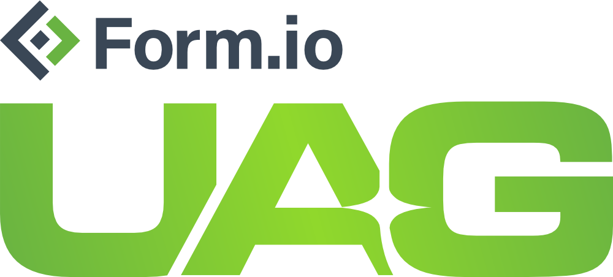
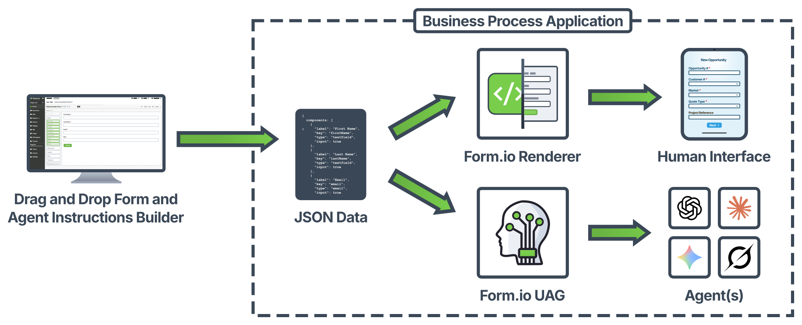
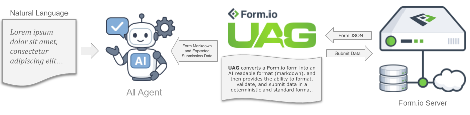
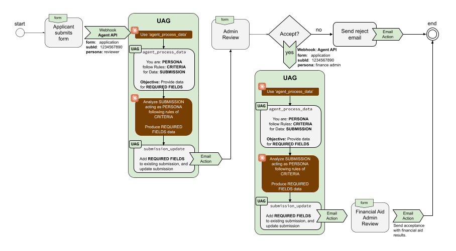
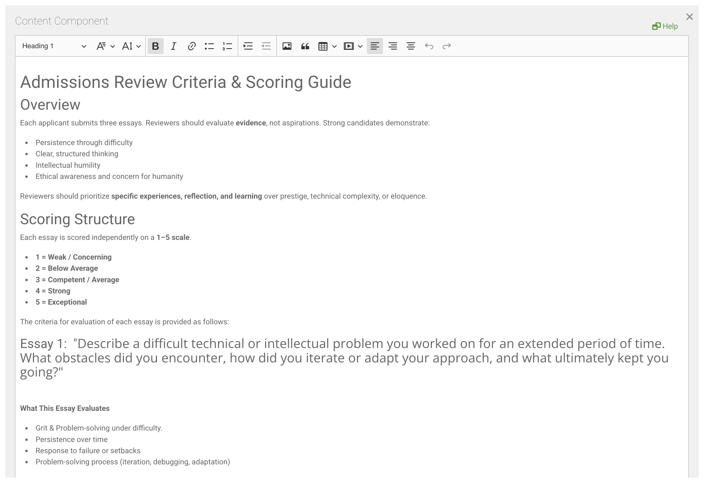
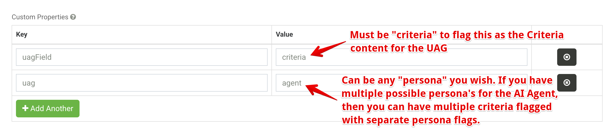
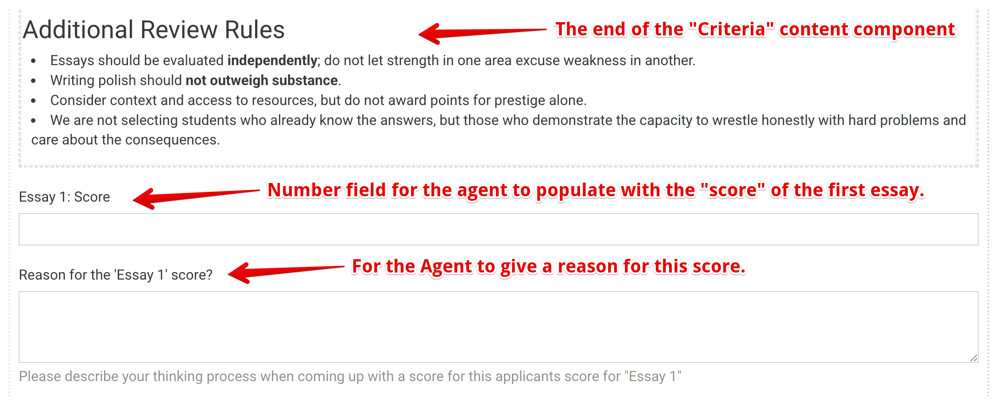
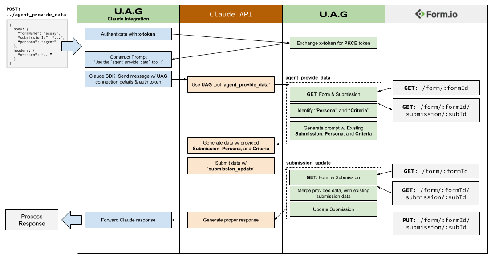
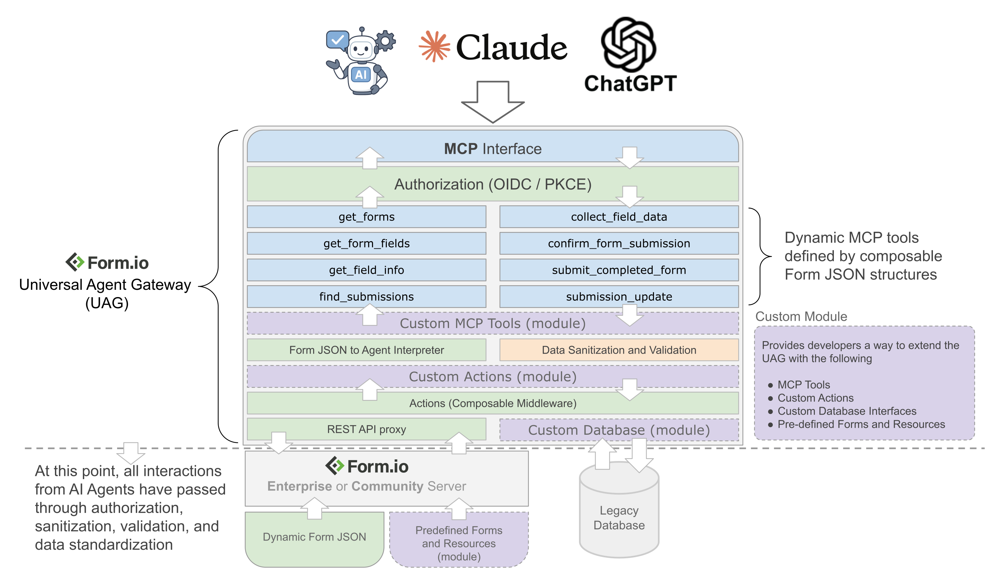

<p align="center">
  
</p>

The Universal Agent Gateway (UAG) leverages the [Model Context Protocol (MCP)](https://modelcontextprotocol.io/docs/getting-started/intro) to enable in-process agentic automation using Form.io. It provides to an AI Agent the same thing that our [JavaScript Renderer](https://github.com/formio/formio.js) provides to a human; an interpretation of the Form JSON schema into an understandable format. In the case of UAG, it transforms the Form JSON model into an AI readible markdown format so that the Agent can easily understand the purpose and structure of the data that needs to be collected.



--------------------------
There are two primary scenarios that the UAG enables:

 - **Unstructured 'chat' input to deterministic form submission**:  This capability uses the JSON schema of a Form.io form to produce a deterministic structured data object provided natural language conversational input. 

 
 
For a working example of this flow, please try out the [Conversation Form Example](./examples/conversation-form).

 - **Agentic Form.io Workflows**: UAG provides an AI Agent the ability to take existing submission data + "context" criteria in order to prompt an AI Agent to provide its own data and analysis within a workflow scenario. The following example, which shows a college application process using a Form.io application form, shows how this primary scenario works.

  

For more information on Agentic workflows, checkout the dedicated [Agentic Workflows](#agentic-workflows) section. For a working example of this flow, please try out the [Agentic Workflow Example](./examples/agentic-workflow).

---

One of the many benefits that the UAG has to offer is the ability to inject **Dynamic Context** into an AI processing cycle. This is achieved from the dynamic nature of the Form JSON schemas that can easily be modified and deployed to any environment without the need to update your application or re-train the agents within the process. Because of this, dynamic context changes can be injected seamlessly into an existing running process which will automatically update the behaviors of the Agents utilizing the UAG.

## Try it out!
There are three working examples in this repo, each spinning up a Form.io server alongside the UAG with Docker Compose. Pick the one that matches what you are building.

| Example | Pattern | Licensing |
|---------|---------|-----------|
| **[Custom Module](examples/custom-module)** | **Conversational, existing client.** Connect Claude Desktop to your forms and talk to them: "I would like to add a new customer." Built as a custom module, so roles and permissions decide what the agent may do. | Open Source — free |
| **[Conversation Form](examples/conversation-form)** | **Conversational, your own UI.** A chat application whose questions come entirely from a form. About 200 lines, no field names in the code — edit the form and the conversation changes. | Open Source — free |
| **[Agentic Workflow](examples/agentic-workflow)** | **Autonomous.** A submission triggers an agent that scores it against a rubric and writes its decision back, which in turn triggers a second agent. No human, no chat window. | Enterprise |

There is also a [Flow Viewer](examples/flow-viewer) — a small proxy that shows every leg of an agentic run live, which is the fastest way to see what an agent is actually doing.

## Documentation in this repository

This file is the main reference: what the UAG is, how to configure a form for it, how to deploy it, and how to troubleshoot it. The rest of the documentation lives next to the code it describes.

| Document | What it covers |
|----------|----------------|
| **README.md** (this file) | Concepts, [agentic workflow setup](#agentic-workflows), the [MCP tools](#pre-defined-mcp-tools-providing-dynamic-context), [deployment](#deploying-uag), [environment variables](#environment-variables), and [troubleshooting](#troubleshooting). |
| [module/Readme.md](./module/Readme.md) | Building a **custom module** — adding your own MCP tools, form actions, pre-defined forms and resources, and configuration overrides, then mounting it into the Docker container. |
| [integrations/claude/Readme.md](./integrations/claude/Readme.md) | The **Claude integration**: its API endpoints and commands, how to run it with Node or Docker, its environment variables, and how to trigger it from a Form.io Webhook action. |
| [examples/custom-module/Readme.md](./examples/custom-module/Readme.md) | Example — a custom module driven conversationally from **Claude Desktop**, where roles and permissions govern what the agent may do. |
| [examples/conversation-form/Readme.md](./examples/conversation-form/Readme.md) | Example — a **chat application of your own** whose questions come entirely from a form. |
| [examples/agentic-workflow/Readme.md](./examples/agentic-workflow/Readme.md) | Example — an **autonomous, webhook-triggered workflow** with two chained agent personas. |
| [examples/flow-viewer/Readme.md](./examples/flow-viewer/Readme.md) | A small proxy that shows **every leg of an agentic run live** — the token request, each tool call, and the write-back. The quickest way to see what an agent is doing. |
| [examples/custom-module/module/templates/Readme.md](./examples/custom-module/module/templates/Readme.md) | Overriding the **response templates** the UAG returns to the agent, using Lodash templates. |
| [test/e2e/Readme.md](./test/e2e/Readme.md) | The **end-to-end test suite** — its three layers, what each covers, and how to run it. |

---

## Agentic Workflows
One of the more powerful features of the **UAG** is the `agent_provide_data` tool. This tool provides the ability to instruct a generically trained agent how to analyze existing submission data, and then produce its own data by following a configurable **Criteria**. This behavior historically could only be achieved using a specifically trained agent, which does not provide any benefits of dynamic configurability that the Form.io platform offers. This tool is able to achieve this goal by providing a generally trained agent with the necessary "context" it needs to accurately produce its own data as part of an automated workflow. This feature is particularly helpful if you wish to utilize the UAG within an Agentic Workflow, where the AI Agent is capable of understanding structured data, and then contribute its own data by following the configured **Criteria** "context" provided by the UAG. 

For example, let's suppose you wish to automate the backend administration behind a College Application Process. In this example, a potential student submits an application that consists of many different fields of data, such as Academics, Extra curricular activities, Honors, Volunteer work, as well as possibly written Essays. Historically, these applications would be reviewed by an administrator in order to assess the candidates qualifications for acceptance. With the `agent_provide_data` tool, it is now possible to automate this process as the following diagram illustrates.


To achieve this feat, the `agent_provide_data` tool utilizes the following information, which is then fed to the Generally trained agent to produce its own submission data.

 - **Existing Submission Data**: In order for the agent to be able to contribute its own data, it must first have an existing submission to be used as the data that it will analyze according to the configured **Criteria**.
 - **Criteria**: This is a piece of content that provides the agent the **Criteria** to follow when analyzing the data, but also provides instructions on how the agent should populate the **Required Fields**.
 - **Required Fields**: These are the form fields which the Agent is required to fill out as part of the `agent_provide_data` process.

### Setup
 To configure a form to use the `agent_provide_data` tool, you must first designate a section of your form that will be read and used by the AI Agent. This is similar to what you would see in a form that says "For Office Use Only", but instead of a Human contributing to the values of this section, it will be an automated AI Agent. There are two types of fields that can be added to a form to configure it for use by the `agent_provide_data` tool:  **Criteria** and **Agent Fields**

 A complete setup is four steps, and all four are required:

 1. **Tag the form `uag`** (described below) — without this the UAG will not register the form at all.
 2. Add the **Criteria** content component that teaches the agent what to do.
 3. Add the **Agent Fields** the agent is allowed to fill.
 4. Add a **Webhook action** to trigger the agent on submission — see the [Claude Integration](./integrations/claude/Readme.md#formio-webhook-setup). This step requires the Enterprise Server, because the action has to set a request header and transform its payload; on Community Edition, trigger the integration from your own code after creating the submission.

 For a working reference containing all four, see the [Agentic Workflow example](./examples/agentic-workflow).

#### Tagging the form `uag`
The UAG only registers forms that carry the `uag` tag. Any form without it is invisible to every agent and to every tool, including `get_forms`. In the Form Builder this is set under **Form Settings &rarr; Tags**; in a form's JSON it looks like this:

```json
"tags": ["uag"]
```

This is worth checking first whenever an agent insists that a form does not exist, because a missing tag produces no error anywhere — the form simply is not there as far as the agent is concerned. Note also that newly tagged forms are picked up on the next project cache expiry, so allow up to `PROJECT_TTL` seconds (see [Project Cache and TTL](#project-cache-and-ttl)).
 
#### Agent "Criteria" component
The first thing that needs to be configured is a special **Content Component** that instructs the AI Agent how to interpret the data. For example, here is a Criteria content block that was written to instruct an AI Agent on how to assess the submission of a College Application Essay.



The goal of this content is to be written as you would write an instruction manual for a new employee who needs to learn how to analyze and understand the submission data that is provided. It is also used to instruct the AI Agent on how to populate the form values that are configured for that criteria.  Once this criteria is written, It will then need to be "flagged" as a UAG field by adding a property called `uag` and the value of that property is to be thought of as the `persona` of the Agent. This provides the ability to have more than one agent assume different roles as it analyzes the submission data to provide their own values. In addition, the "criteria" content will also need to be provided a `uagField` property with the value equal to `criteria`.  Below is what a properly configured `uag` criteria content component looks like.  



Once you have added this `Criteria` **Content Component** to your form, the next object is to add the fields you wish for the Agent to populate. These are called the **Agent Fields**. 

#### Agent Fields
Anywhere in your form, you can drag and drop fields that can be flagged as Agent fields. Using the example above, imagine your form has a "For Office Use Only" section (maybe a Panel).  Within this panel, the first thing you see is a Content Component with instructions on how the following fields should be filled out. This is the `Criteria` we just described. The next thing that follows are the fields that the Agent needs to populate. Any field that with a property of `uag` set to the same value as the `Criteria` content component will be used as the Agent fields. 

For example, lets suppose that we have created a form for College Application essays. Below the **Criteria** may be some fields that the Agent needs to "score" the essays according to the provided **Criteria**.  This may look like the following...



In order to "flag" each of these fields as Agent Fields, you simply need to add the `uag` property with the same persona flag that was giving to the `Criteria` content.


**Nested Components**
It is also possible to "flag" a collection of fields with the `uag` property. This can be done by wrapping all of these fields within a **Nested Component** (such as Panel, Container, Fieldset, etc), and then all the fields within this nested component will be added to the context of that agent with that persona.

### Multiple Personas per form
It is also possible to achieve multiple personas per-form. This is very helpful if there are several isolated evaluations that need to occur within a process. For example, if we look at the flow chart diagram shown above, we can see a College Application Form. The first agentic evaluation occurs when the form is submitted by the applicant, where their application is assessed to be accepted or not. From that point, IF the applicant is accepted, a completely different evaluation needs to occur to award Financial Aid or even Scholarships to the applicant. These would require completely different criteria to assess the submission data differently from one another.

To achieve this, you simply need to "flag" the components `uag` property value differently with the persona that applies for that field. For the example above, you would add a Content component to assess if the applicant should be accepted, and then provide the following `uag` property to that content.  `uag="application"`.  Any fields that need to be filled out by the AI Agent for application approval would also be flagged with the property `uag="application"`.  Then, in a different section of the form, you would create a separate Content component with the criteria for the financial admin AI Agent. This content would be flagged with the property `uag="finance"`.  Any fields that the finance admin AI Agent need to fill out would also be flagged with `uag="finance"`.  This provides a truly flexible and dynamic AI engagement where multiple generically trained agents can be "taught" dynamically how to read and interpret data that is only relevant to that part of the agentic process.

Agent fields do not have to sit next to their criteria, either. A `status` field in one panel can be flagged `uag="application"` while the field beside it is flagged `uag="finance"`, which is how a single workflow field can be owned by whichever persona is responsible for that stage.

#### Chaining personas into a workflow
Multiple personas on a form are only useful if something triggers the later ones. Because each persona writes to the submission, the natural trigger for the second persona is the *first* persona's write.

This is configured with a second Webhook action that fires on `update` rather than `create`, narrowed by a condition on a field that the first persona sets:

```json
{
  "name": "webhook", "handler": ["after"], "method": ["update"], "priority": 0,
  "condition": {
    "conjunction": "all",
    "conditions": [
      { "component": "status", "operator": "isEqual", "value": "scholarshipEvaluation" }
    ]
  },
  "settings": {
    "method": "post",
    "url": "http://formio-uag-claude:3300/agent/claude/agent_provide_data",
    "headers": [{ "header": "x-token", "value": "<your project API key>" }],
    "transform": "payload = {formName: 'application', submissionId: payload.submission._id, persona: 'finance'};",
    "block": false
  }
}
```

In the college application workflow, the admissions persona sets `status` to `scholarshipEvaluation` only for applicants on the scholarship track, so only those submissions wake the finance persona. Applicants who were simply accepted or declined never trigger it.

> **Avoid loops.** The second persona also writes to the submission, which fires the same `update` webhook again. Make sure each persona's own write cannot re-match the condition that triggered it — in the example above the finance persona sets `status` to `scholarshipGranted`, which no longer satisfies the condition, so the workflow terminates. A condition that stays true after the persona runs will loop indefinitely and consume API credits until you stop the container.

A complete, runnable version of this two-persona workflow is in the [Agentic Workflow example](./examples/agentic-workflow).

## Integrations
In order to aid in the "agentification" of the UAG, we have also provided some "integrations" that can be used to directly communicate with the Generically trained AI Agents to utilize the UAG to accomplish automated AI Agent behaviors. This involves providing a single API endpoint that is capable of triggering the AI Agent process along with the connections to your deployed UAG. These API endpoints can then be triggered using a simple Webhook action within a form to start an Agentic process as the result of a Form submission. Here is a diagram of how specific integrations can be used to achieve a single API call to accomplish an agentic task.



Each integration runs its own MCP client and connects *out* to the UAG, so the UAG does not need to be publicly accessible for these to work — it only needs to be reachable from the integration, such as over a private Docker network or on `localhost`.

These integrations can be found within the **integrations** folder. The following **integrations** are provided to enable automated Agentic workflows.

  - [Claude Integration](./integrations/claude)

Please click on one of these integration links to read how they work.

---

## Technical Overview
The UAG can be thought of as consisting of many layers of functionality. Each layer is broadly either serving to fetch dynamic context, or submit deterministic data structures. The following layers are leveraged within the UAG:

 1. **MCP Interface**:  The entry point of the UAG is the MCP interface that sits between the AI agent and the tools that are executed on the server.
 2. **Authorization**:  As part of the MCP specification, every interaction between the AI agent and the backend service must pass through an Authorization process leveraging OIDC (PKCE) authentication. The UAG takes this process one step further, however, by adding an OIDC (PKCE) authentication layer on top of the existing authentication flexibilities that Form.io already provides. Because of this, it is possible to authenticate with the UAG if you are using SAML, Form.io Authentication, OIDC, or even Custom Authentication processes through the Form.io platform.
 3. [**Pre-defined MCP Tools providing Dynamic Context**](#pre-defined-mcp-tools-providing-dynamic-context): The UAG utilizes the MCP to provide a number of pre-defined tools that provide AI agents with dynamic context based on the Forms and Resources marked as compatible within the Form.io platform. These tools are described in more detail in a section below.
 4. **Custom Tools** (provided by [Custom Modules](#custom-modules)): This enables developers to introduce any new tools that can leverage Form.io forms and submission data structures to provide additional capabilities introduced to the AI agents. This would allow for custom agent interactions to achieve certain goals for specific use cases.
 5. **Custom Actions** (provided by [Custom Modules](#custom-modules)): Enables developers to create composable middleware that will be executed once all data provided by the AI agent has been sanitized and validated. This provides the ability to interface the data collected from AI agents with any backend system or workflow.
 6. **Built-in Actions**: In addition to any custom actions introduced via a Module, the UAG supports a handful of existing Actions that can be assigned to any form or resource. Actions such as the **Webhook** that will send a REST API call to any endpoint once any submission has been made by an AI agent. This can be used to point to any serverless function to instigate backend workflows that are triggered from the interactions from AI agents.
 7. **Pre-defined Forms and Resources** (provided by [Custom Modules](#custom-modules)): Allows a developer to release a module that provides default data structures to the AI agent. This would be useful if a developer wishes to create a module that achieves a specific goal, where the data structures required for that goal need to follow a pre-determined set of fields provided by a form or resource. For example, if a developer wishes to release a CRM module for the UAG, then it would make sense that the module would also provide the default **Customer** and **Company** resources that commonly accompany most CRM implementations. 
 8. **Custom Database** (provided by [Custom Module](#custom-modules)): By default, the UAG performs the data collection and retrieval via a "Submission Proxy", whereas the data is submitted via REST API to either the Enterprise Server project or the Open Source server. This, however, could be modified to send the data directly to and from a Database. This can be achieved via the Database Interface provided from the UAG. For more information, see the **Module** documentation. This feature does require that the UAG is connected to the Enterprise Server.
   
Here is a diagram to understand how all of these layers are organized to make up the UAG.



### Pre-defined MCP Tools providing Dynamic Context
The following tools provided by the UAG can be described as follows:

| Tool Name       | Tool Description     |
|-----------------|----------------------|
| get_forms       | Provides the AI agent with a list of available forms. <br/>It will only return forms that have been tagged `uag`. |
| get_form_fields | When the AI agent infers the user intends to use a specific form, this tool provides the agent with a high level overview of all the fields needed (along with the field data path) to submit that form. |
| get_field_info | Once the fields have been determined using `get_form_fields`, this tool provides specific information about the requested fields, such as validation, conditionals, input formats, etc. <br/>This tool instructs the AI agent on how to format and structure the data that is sent to the MCP server. |
| collect_field_data  | Provides the AI agent with a mechanism to dynamically collect the required information from the user. It can parse the user's input into multiple fields at once, and will identify additional inputs from the user if needed. <br/>This tool supports complex and structured data collection and is compatible with nested or multi-value fields like nested forms, data grids, etc.       |
| confirm_form_submission | This tool is used to provide a summary of all data collected before a submission is made to the form. |
| submit_completed_form | Provides the AI agent with the ability to submit all of the data collected from the user to create the form submission. |
| find_submissions | Enables the agent to parse a user's natural language request into a query for a submission, or a specific field of a particular submission. |
| submission_update | Provides the AI agent with the ability to update an existing submission, either by supplying unfilled fields or updating existing ones if allowed. Provides the AI agent with the context of the existing field values, allowing inline changes or edits. |
| agent_provide_data | Enables an AI Agent to be able to analyze existing submission data according to rules defined with a configurable **Criteria**. It will then instruct the Agent to provide generated data for fields configured for a specific **persona** using the `submission_update` tool. Please read the [**Agentic Workflows**](#agentic-workflows) section for more information about this toolset. |
| fetch_external_data | This tool enables an AI Agent to pull external data into a form workflow through the use of either a Resource component, Select with URL, or a Data Source component. |

### Custom Modules
While the UAG can be used as a stand-alone system to enable the interaction between AI agents and dynamic JSON forms, the true power of this platform will be realized when developers extend the capabilities of this platform to solve industry specific use cases through the use of Custom Modules and Tools. It is possible for a developer to create a **Module** that introduces a number of custom tools, actions, and pre-defined resources and forms to achieve interactions with industry specific technologies. They are able to achieve this custom integration capabilities through the use of the following mechanisms:

 1. **Pre-defined Form and Resources**: Using the Form.io template system, a custom module can include a template export of a Form.io project that includes a number of Forms, Resources, and Actions (as well as any Roles and Permissions associated with them). By using the module, this will then automatically "register" these assets so that the AI agent is immediately aware of those assets.  
 For example, imagine a module includes a Customer resource with "First Name", "Last Name", and "Email" fields. If you then simply ask an AI agent, "I would like to add a new Customer" the agent will automatically be aware of the context for the customer data structures and know exactly what your intent is when making that request.
 2. **Custom Actions**: Actions can be thought of as composable middleware functions that allow for configurable Express.js middleware functions to be attached to any Form and Resource, and then to be executed once the data being submitted by an AI agent has passed through the proper data validations and sanitization. These can be used to provide custom integrations to backend processes and workflows.
 3. **Custom Tools**: In addition to providing custom actions, a Module can also introduce custom MCP Tools to provide bespoke interaction capabilities between the UAG and the AI agents for any industry specific purposes.
 4. **Custom Authentication**: A module can also modify the "authentication" landing page to assist with any custom requirements that are needed around Authentication. 
 5. **Behavior Overrides**: A module also has the ability to "override" any default behavior from the UAG. This ensures that whomever is using a certain module can "tweak" certain tools and responses to achieve better results as it pertains to their industry specific needs.

Form.io aims to enable developers to build and contribute their own custom modules to the broader community through GitHub and NPM. 

#### Using a Custom Module
Once a custom module is developed, anyone can install that module (via NPM) and then easily use your module in the following way...

<sub>This is just an example.</sub>
```js
import { UAGServer } from '@formio/uag';
import { ExampleUAG } from '@example/uag';
import Express from 'express';
try {
    (async function () {
        const server = new UAGServer();
        server.use(ExampleUAG);
        const app = Express();
        app.use(await server.router());
        const port = process.env.PORT || 3200;
        app.listen(port, () => {
            console.log(`Form.io UAG server running on port ${port}`);
            console.log(`Visit http://localhost:${port} to access the application`);
        });
    })();
} catch (error) {
    console.error('Failed to start server:', error);
    process.exit(1);
}
```

To get started in building your own custom module, go to the help documentation at [Modules Readme](./module/Readme.md).

## Deploying UAG
The following sections describe the process of creating a running instance of UAG, connecting it to the Form.io Platform, and configuring an AI agent to use it.

This documentation focuses on using UAG with Form.io Open Source. For documentation on using UAG with Form.io Enterprise, refer to [https://help.form.io/uag](https://help.form.io/uag).

### How Agents Connect
Before deploying, it is worth deciding **which side opens the connection** to the UAG's `/mcp` endpoint, because that single decision determines whether the UAG needs to be publicly accessible.

| Connection model | Who runs the MCP client | Does the UAG need a public domain? |
|------------------|-------------------------|------------------------------------|
| **Local MCP client** | Your own application or integration, running alongside the UAG | **No.** The UAG only needs to be reachable from that process — `http://localhost:3200` or a private Docker network address is fine. |
| **Remote MCP client** | A hosted agent that dials into your UAG (Claude.ai and Claude Desktop connectors, the Anthropic MCP connector, or any other remote MCP host) | **Yes.** The agent must be able to reach `/mcp` and the OAuth discovery endpoints over the public internet. |

With a **local MCP client**, your application connects *out* to the UAG, calls the tools itself, and passes the results on to whichever model it is using. Nothing dials back in, so the UAG can stay entirely inside your network. This is how the [Claude Integration](./integrations/claude) works, and it is the recommended model for server-to-server and webhook-triggered automation — including running the whole stack on a developer machine.

> If you are using the published Claude integration image, this requires **`formio/uag-claude:1.3.0` or newer**. Earlier images handed the MCP server URL to the Anthropic API as a *remote* connector, meaning the API dialed into your UAG and a public URL was mandatory. An older image pointed at a private address fails with a `400` from the Anthropic API reading `Connection error while communicating with MCP server`, which looks like a UAG fault but is not one.

With a **remote MCP client**, the agent lives outside your network and connects in, so `/mcp` and the `.well-known` OAuth discovery endpoints must be publicly reachable over HTTPS, and `BASE_URL` must be that public URL. See [Domain and URL Configuration](#domain-and-url-configuration).

Both models can be used against the same UAG deployment at the same time.

#### Authenticating a local MCP client
A remote agent authenticates through the browser-based OAuth (PKCE) flow. A local client has no browser, so it exchanges a server-side key for an access token using the `client_credentials` grant against `{{ BASE_URL }}/auth/token`, then sends that token as a `Bearer` token on its `/mcp` requests.

The `client_id` must be prefixed with the project name — which is `formio-oss` for Open Source deployments:

```
POST /auth/token
Content-Type: application/json

{
  "grant_type": "client_credentials",
  "client_id": "formio-oss-x-admin-key",
  "client_secret": "{{ ADMIN_KEY }}"
}
```

For Enterprise, use the project name from your project endpoint together with the project API key — for example `"client_id": "myproject-x-token"` with `"client_secret": "{{ PROJECT_KEY }}"`.

The response contains an `access_token`, which is passed to the UAG as `Authorization: Bearer {{ access_token }}`. Tokens expire according to `JWT_EXPIRE_TIME`, so long-running clients should cache the token and refresh it before it expires. See [`integrations/claude/auth.js`](./integrations/claude/auth.js) for a working implementation.

### Runtime Environments
There are currently two run-time environments that work with the UAG:
 - [**Docker**](#docker)
 - [**Node.js (Express)**](#nodejs-express)


### Docker
Running the UAG in Docker enables a wide range of deployment options into common hosting environments such as AWS and Azure. Additionally, it allows for the use of common orchestration runtimes such as Kubernetes and Docker Compose. The container that you will run the UAG is as follows:

```
formio/uag
```

This container can be run in two ways:  
  - [**Docker-Compose.yml**](#docker-compose-recommended) - The recommended method, deploys as a multi-container Docker Compose stack.
  - [**Docker Run**](#docker-run) - a standalone container using the common `docker run` command.


#### Docker Compose (Recommended)
The recommended way to launch the UAG is through Docker Compose. This enables you to orchestrate several of the containers to run within a single instance to provide a more seamless and simple way of managing your deployments. Here is a simple example of how to run both the Form.io UAG + Form.io OSS server on the same instance.

docker-compose.yml
```
services:
  mongo:
    image: mongo
    restart: always
    volumes:
      - ./data/db:/data/db
    environment:
      - MONGO_INITDB_ROOT_USERNAME
      - MONGO_INITDB_ROOT_PASSWORD
  formio:
    image: formio/formio:rc
    restart: always
    links:
      - mongo
    depends_on:
      - mongo
    environment:
      PORT: 3000
      DEBUG: formio.*
      NODE_CONFIG: '{"mongo": "mongodb://mongo:27017/formio-oss", "jwt": {"secret": "CHANGEME"}, "mongoSecret": "CHANGEME"}'
      ROOT_EMAIL: admin@example.com
      ROOT_PASSWORD: CHANGEME
      ADMIN_KEY: CHANGEME
    ports:
      - "3000:3000"
  formio-uag:
    image: formio/uag
    restart: always
    links:
      - formio
    depends_on:
      - formio
    environment:
      PORT: 3200
      DEBUG: formio.*
      PROJECT: http://formio:3000
      ADMIN_KEY: CHANGEME
      JWT_SECRET: CHANGEME
      JWT_EXPIRE_TIME: 525600
      LOGIN_FORM: http://localhost:3000/user/login
      # The address clients reach the UAG at — this is the UAG's own port,
      # not the Form.io server's. See the BASE_URL section below.
      BASE_URL: http://localhost:3200
    ports:
      - "3200:3200"
```

This can be run by typing the following...

```
docker compose up -d
```

#### Docker Run
Here are some examples of running the UAG using the ```docker run``` command.

**UAG pointed to an Open Source server**
```
docker run -d \
  -e "PROJECT=https://forms.mysite.com" \
  -e "ADMIN_KEY=CHANGEME" \
  -e "JWT_SECRET=CHANGEME" \
  -e "BASE_URL=https://forms.mysite.com" \
  -e "LOGIN_FORM=https://forms.mysite.com/user/login" \
  -e "PORT=3200" \
  --restart unless-stopped \
  --network formio \
  --name formio-uag \
  -p 3200:3200 \
  formio/uag
```

**UAG pointed to a Form.io Enterprise Server**
```
docker run -d \
  -e "PROJECT=https://forms.mysite.com/myproject" \
  -e "PROJECT_KEY=CHANGEME" \
  -e "UAG_LICENSE=YOUR-LICENSE" \
  -e "JWT_SECRET=CHANGEME" \
  -e "PORTAL_SECRET=CHANGEME" \
  -e "BASE_URL=https://forms.mysite.com" \
  -e "LOGIN_FORM=https://forms.mysite.com/myproject/user/login" \
  -e "PORT=3200" \
  --restart unless-stopped \
  --network formio \
  --name formio-uag \
  -p 3200:3200 \
  formio/uag
```

Once it is running, you can then navigate to the following to access both the OSS Deployment + UAG Server
 - http://localhost:3000:  The Form.io OSS Server
 - http://localhost:3200:  The UAG Server

In both the Node.js runtime environment as well as Docker, the way to control the UAG is through the use of **Environment Variables** and **Modules**.

### Environment Variables
This module can be configured in many ways. One of those ways is through the use of Environment Variables, which are documented as follows.

| Variable | Description | Example |
|----------|-------------|---------|
| PROJECT | The API Endpoint to either an Enterprise project endpoint, or the OSS server url. | http://localhost:3000 |
| PROJECT_KEY | (Enterprise Only) The API Key of the project this UAG is bound to, found in **Project Settings &rarr; API Keys**. Open Source deployments use `ADMIN_KEY` instead. | CHANGEME |
| ADMIN_KEY | (Open Source Only) Allows you to provide the ADMIN_KEY to install and connect to the OSS Server. | CHANGEME |
| UAG_LICENSE | The license to run the UAG against a Form.io Enterprise Deployment. | |
| PROJECT_TTL | The project cache TTL in seconds. This controls the amount of time to check for any "changes" that have been made to the project to refresh any forms and resources within the UAG. | 900 |
| PORT | The port you wish to run the server on. | 3200 |
| DEBUG | Variable used to perform debug logs of server activity | formio.* |
| PORTAL_SECRET | Enterprise Only:  Allows you to connect to the UAG from the Form.io Enterprise Portal. | CHANGEME |
| JWT_SECRET | A secret used to generate and validate JWT tokens generated through the authentication process of the UAG. This does not need to match the JWT_SECRET of the Enterprise Server that it is connected to. | CHANGEME |
| JWT_EXPIRE_TIME | The expiration for the jwt secret. | 3600 |
| MONGO | (Enterprise Only) Allows you to connect the UAG directly to a mongo database, rather than having to redirect the submissions to the Form.io Submission APIs. | |
| MONGO_CONFIG | JSON configuration for the Node.js Mongo Driver. | |
| BASE_URL | **Required.** The URL that the UAG is reachable at *by its clients*. It is published in the `.well-known` OIDC (PKCE) definitions and used for authentication callbacks. This must be a public URL when remote agents connect in; for a local MCP client, a private or localhost URL is fine. | https://forms.yoursite.com |
| LOGIN_FORM | The URL to the Login Form JSON endpoint, loaded by the `/auth/authorize` page. Only used by the browser-based login flow, so it must be reachable by that browser. | https://mysite.com/project/user/login |
| CORS | The cors domain, or the JSON configuration to configure the "cors" node.js module cross domain resource sharing. | *.* |
| NODE_TLS_REJECT_UNAUTHORIZED | Standard Node.js variable. Set to `0` when `PROJECT` is an `https` URL secured by a self-signed or otherwise untrusted certificate, which is common for local and internal deployments — without it the UAG cannot connect to the server and every tool call fails. Never set this on a deployment reachable from outside your network, since it disables certificate verification for all outbound requests. | 0 |

### Project Cache and TTL
By default, the UAG uses a TTL to "fetch" any of the project assets and register them and cache them into the UAG. What this means is that if you make any changes to your underlying project forms and resources (either directly or through a deployment), you need to wait a maximum of the TTL setting (in seconds) to see any updates that have been made. For example, if the TTL is set to 900 (or 15 minutes), and you make a change to any forms and resources, you must wait at most 15 minutes to see any of these changes take effect into the UAG. It should be noted that when a "refresh" occurs, an API call to the "export" method is called on the underlying project endpoint. This is a processor intensive API call, so it is not recommended to set the TTL to any value less than 60.  A value of 0 is interpreted as "No TTL", which means the only way to refresh the project forms and resources, a UAG reboot is necessary.

Here is a table explaining how this parameter can be used.

| Environment Variable | Value | Result |
|----------|-------------|---------|
| PROJECT_TTL | 0 | No TTL (refresh) will occur.  This can be used to "disable" any refresh and ensure the ONLY way to refetch updated forms and resources, you must reboot the UAG server. |
| PROJECT_TTL | 60 | Check for changes every minute |
| PROJECT_TTL | 3600 | Check for changes every hour |

This cache is the reason a form edit does not appear to take effect immediately. Anything that changes what the agent knows — adding the `uag` tag, rewriting a **Criteria** content component, adding or removing **Agent Fields** — only reaches the agent after the next expiry. When you are actively iterating on criteria, restarting the UAG re-registers the project immediately instead of waiting:

```bash
docker restart formio-uag
```

### Domain and URL Configuration
There are 3 different "domain" environment variables that matter, and it is important to understand how to configure them depending on your use case. Whether any of them need to be *public* depends on how agents connect — see [How Agents Connect](#how-agents-connect).

If a remote agent connects into your UAG, these must be configured correctly and publicly, or the agent will not be able to authenticate. If you only use a local MCP client, all three can point at private or localhost addresses.

#### PROJECT
The ```PROJECT``` environment variable is used to establish a connection from the UAG server to the project endpoint (for Enterprise) or OSS base url. This does NOT need to be a public DNS entry, but rather a URL that connects the UAG container to the Server container.  The following examples illustrate how this would be configured.

##### Local connection to OSS Server
If you are using a local connection, such as within a Docker Compose file, you can configure the ```PROJECT``` environment variable to point directly to the local url as follows.

docker-compose.yml
```
services:
  formio:
    image: formio/formio:rc
    restart: always
    environment:
      PORT: 3000
      ADMIN_KEY: CHANGEME
  formio-uag:
    image: formio/uag
    restart: always
    links:
      - formio
    depends_on:
      - formio
    environment:
      PROJECT: http://formio:3000
      ADMIN_KEY: CHANGEME
```

In this example, we have Docker Compose launching the OSS Form.io container with the ADMIN_KEY set for this deployment, the UAG is connected using ```http://formio:3000``` which is the local Docker network name (provided using the "links" property in the docker compose file).

##### Local Connection to Enterprise Server Project
If you are using the Enterprise Form.io server within a local environment to the UAG, then you will need to ensure that the UAG connects to an independent project using the PROJECT_KEY as follows.

docker-compose.yml
```
services:
  formio-enterprise:
    image: formio/formio-enterprise
    restart: always
    environment:
      PORT: 3000
  formio-uag:
    image: formio/uag
    restart: always
    links:
      - formio-enterprise
    depends_on:
      - formio-enterprise
    environment:
      PROJECT: http://formio-enterprise:3000/myproject
      PROJECT_KEY: CHANGEME
```

##### Public DNS
If your project does not reside on the same network as the UAG, you can provide the domain name as the PROJECT as follows.

docker-compose.yml: Connected to Enterprise (formio/formio-enterprise)
```
services:
  formio-uag:
    image: formio/uag
    restart: always
    environment:
      PROJECT: https://forms.mydomain.com/myproject
      PROJECT_KEY: CHANGEME
```

docker-compose.yml: Connected to Open Source (formio/formio)
```
services:
  formio-uag:
    image: formio/uag
    restart: always
    environment:
      PROJECT: https://forms.mydomain.com
      ADMIN_KEY: CHANGEME
```

#### BASE_URL
The ```BASE_URL``` tells the UAG what URL it is reachable at. This value is published within the ```.well-known``` definitions for the OIDC (PKCE) authentication, and is used for the authentication callbacks.

**```BASE_URL``` is always required**, including for local clients. The UAG's authentication provider is only enabled when it is set, so if you omit it, ```/mcp``` returns a 401 for every request and the ```/auth/token``` and ```/.well-known/*``` endpoints do not exist at all (404). A 404 on ```/auth/token``` is the clearest signal that ```BASE_URL``` is missing.

What it needs to be set to depends on how agents connect:

 - **Remote agents connect in**: this must be the publicly accessible domain hosting your UAG, because that is the address the agent is told to authenticate against. For example, ```BASE_URL: https://forms.mysite.com```.
 - **Local MCP client only**: set it to the address your client uses to reach the UAG. A private or localhost URL is fine — for example ```BASE_URL: http://localhost:3200``` or ```BASE_URL: http://formio-uag:3200``` within a Docker network.

If a remote agent cannot authenticate, a mismatched ```BASE_URL``` is the most common cause: the agent reads this value from the discovery document and will follow it, so if it points somewhere the agent cannot reach, authentication fails even though the UAG itself is running correctly.

#### LOGIN_FORM
This is the URL to the Login form of your Project or OSS deployment. It provides the form that is loaded when a user navigates to ```{{ BASE_URL }}/auth/authorize```.  If you navigate to this URL, and the page says that you cannot load the form, then this is because your LOGIN_FORM environment variable is not pointing to the correct form JSON endpoint of your project. 

This is only used by the browser-based login flow, so it needs to be reachable by the browser performing that login. A local MCP client authenticating with the `client_credentials` grant never loads this page.

For example:
 - Enterprise Example: ```LOGIN_FORM: https://forms.mysite.com/myproject/user/login```
 - OSS Example:  ```LOGIN_FORM: https://forms.mysite.com/user/login```

### Node.js (Express):
With the Node.js environment, you can import the UAG within a locally running Node.js and Express.js environment. This works by first importing the UAG module and "use"ing it within an Express.js application. First, you will install the UAG inside of your Node.js Express application like the following.

```npm install --save @formio/uag```

or

```yarn add @formio/uag```

You can then mount the UAG within your Express application, as seen in the following example:

```js
import 'dotenv/config';
import Express from 'express';
import { UAGServer } from '@formio/uag';
try {
    (async function () {
        const server = new UAGServer();
        const app = Express();
        app.use(await server.router());
        const port = process.env.PORT || 3200;
        app.listen(port, () => {
            console.log(`Form.io UAG server running on port ${port}`);
            console.log(`Visit http://localhost:${port} to access the application`);
        });
    })();
} catch (error) {
    console.error('Failed to start server:', error);
    process.exit(1);
}
```

There is also a way to extend the functionality of the UAG through the use of modules, which is documented in the [Modules Readme](./module/Readme.md)

## Using with Form.io Enterprise Server
When using the UAG with the Form.io Enterprise Server, you unlock several benefits with regards to managing the Forms and Resources within the UAG. Some of the features that you gain with our Enterprise Server include:

 - **Form Revisions** - Our form revision system provides a way to keep track of any changes made to any forms, and associate those changes with the submission data that is submitted against those revisions. This feature enables you to ensure that if any form schemas change, that the data submitted for that form correlates with the revision of the form in which it was submitted. In addition to this powerful feature, you can also leverage Form Revisions as a method to "roll-back" any mistakes or regressions caused by form changes. Instead of having to re-train or un-train an AI agent with any schema, you simply revert to previous revisions and the AI agent will adjust accordingly.
 - **Submission Revisions** - Submission revisions provides a way to keep track of any data changes that have been made to a submission and provides information on who changed the data. This combined with the power of the UAG provides any system the ability to audit any changes in data made by both AI agents as well as humans in the workflow processes.
 - **Stage Versions and Deployments** - Stage versions provides a way to create a "tag" version across all forms and resources within a project. This ensures that you can stamp a point in time where your AI agent (which may consume many different forms and resources) interfaces with your whole project in a deterministic way. It also provides a much more elegant "roll-back" mechanism where the entire project of forms and resources can be versioned and deployed independently.

### Running the UAG against the Enterprise Server
In order to run the UAG against an Enterprise Server, you need to provide a few Environment variables that are different from the OSS runtime of this module. The following environment variables are required to run against an Enterprise Project.

| Variable | Description | Example |
|----------|-------------|---------|
| PROJECT | For the Enterprise Server, this points to the Project Endpoint you wish to bind the UAG to. | https://mydeployment.com/myproject |
| PROJECT_KEY | An API Key for that project, provided within the Project Settings | CHANGEME |
| UAG_LICENSE | This is the license provided to you from the Form.io License team. Contact support@form.io to acquire a "temporary" or full license. | |

Once you have these environment variables in place, you should be able to run the UAG pointed to your Enterprise Project.

## Troubleshooting
Most UAG problems are configuration, not code, and they tend to surface far from their cause — a missing tag looks like a missing form, and a missing `BASE_URL` looks like a permissions error. The table below maps the symptoms you are likely to see back to what actually produces them.

| Symptom | Likely cause |
|---------|--------------|
| The agent says a form does not exist, or `get_forms` does not list it | The form is not tagged `uag`, or the change has not survived the project cache yet. See [Tagging the form `uag`](#tagging-the-form-uag) and [Project Cache and TTL](#project-cache-and-ttl). |
| `/auth/token` returns `404`, and `/.well-known/*` is also missing | `BASE_URL` is not set. The authentication provider is only enabled when it is present, so those endpoints do not exist at all. See [BASE_URL](#base_url). |
| Every `/mcp` request returns `401` | Either `BASE_URL` is unset (as above), or the client is not sending `Authorization: Bearer <token>`. For a server-side client, see [Authenticating a local MCP client](#authenticating-a-local-mcp-client). |
| A remote agent (claude.ai, Claude Desktop connector) cannot authenticate | `BASE_URL` does not point at a publicly reachable HTTPS URL. The agent reads that value out of the discovery document and follows it, so it must be correct from the agent's perspective, not the server's. |
| The Claude integration returns `400 ... Connection error while communicating with MCP server` | The `formio/uag-claude` image predates `1.3.0` and is treating the UAG as a *remote* MCP server, so the Anthropic API is trying to dial into a private address. Upgrade to `1.3.0` or newer. See [How Agents Connect](#how-agents-connect). |
| The UAG cannot reach the server at all, and every tool fails | If `PROJECT` is an `https` URL with a self-signed certificate, set `NODE_TLS_REJECT_UNAUTHORIZED=0`. Otherwise check that `PROJECT` is resolvable *from inside the UAG container* — it is a container-to-container address, not a browser one. See [PROJECT](#project). |
| Nothing happens when a submission is created | The Webhook action did not fire. Confirm its `handler` is `after` and `method` includes `create`, and that the API key header matches the integration's `PROJECT_KEY` (Enterprise) or `ADMIN_KEY` (OSS). |
| A submission is created but the response hangs for a long time | The Webhook action has `block: true`. Agent runs take tens of seconds; set `block: false` so the submitter is not made to wait. |
| An agent runs continuously and burns API credits | A chained persona is re-triggering itself. Its own write still satisfies the condition on the `update` webhook that started it. See [Chaining personas into a workflow](#chaining-personas-into-a-workflow). |
| The agent fills in some fields but not others | Those fields are missing the `uag` property, or its value does not exactly match the persona on the **Criteria** component. Every field the agent may write must carry the same persona, either directly or by inheriting it from a parent component. |
| The agent writes values the form rejects | The **Criteria** is not specific enough about formats and allowed values. State units, rounding, and exact option values, and name the field keys verbatim. |
| A run fails and the logs are not enough to see where | Put the [Flow Viewer](./examples/flow-viewer) in front of the UAG. It shows the token request, `tools/list`, each tool call with arguments, and the write-back in order. |

If none of these apply, run one of the [examples](#try-it-out) to confirm the environment itself is sound, then compare its configuration against yours.

