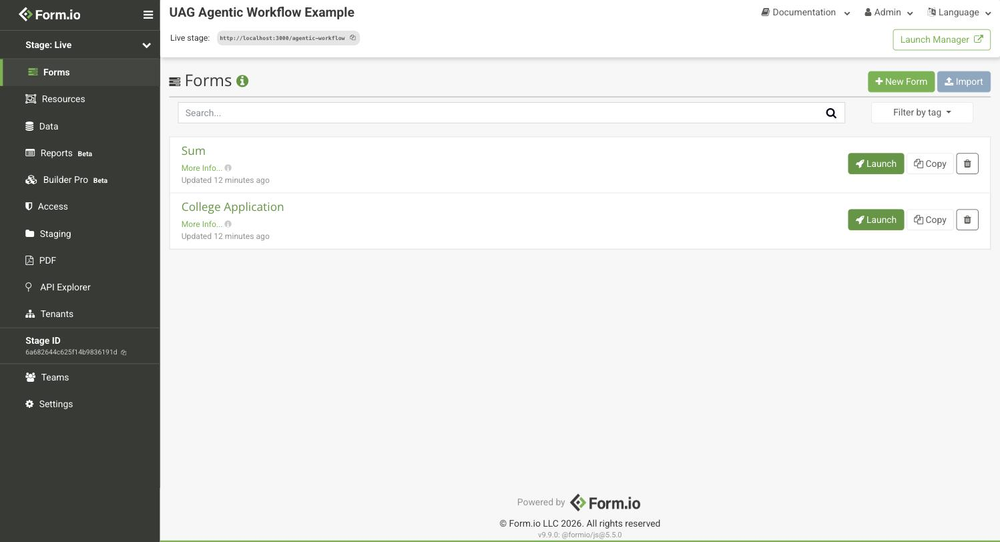
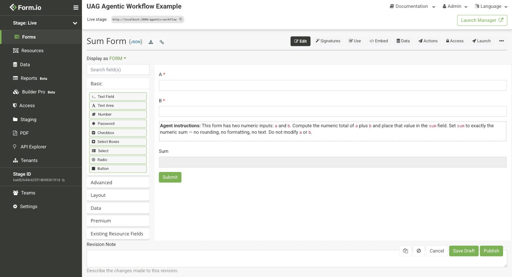
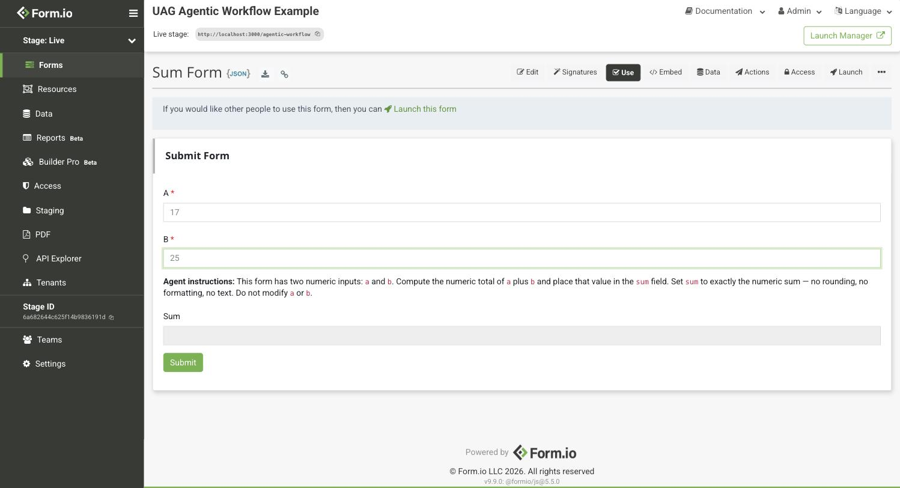
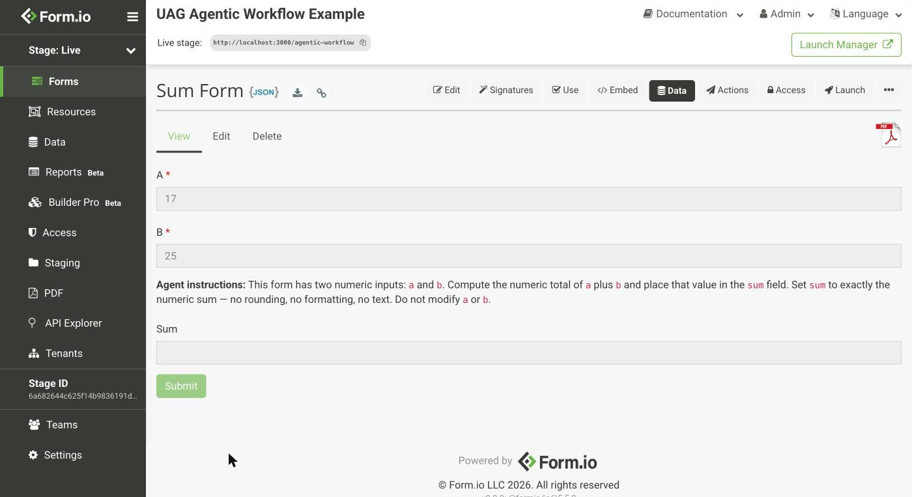
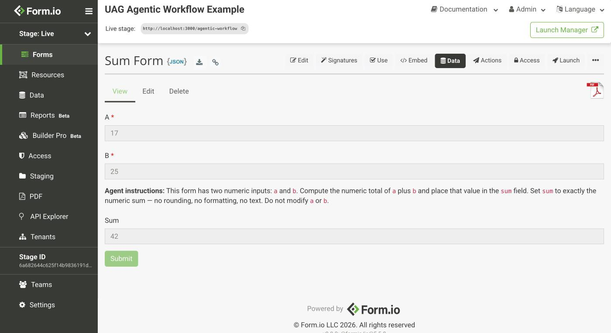

# Example: Autonomous Agentic Workflow

<sub>[Form.io UAG](../../README.md) &rsaquo; this page</sub>

This example runs the College Application workflow described in the [main Readme](../../README.md#agentic-workflows) as actual working software. A student submits an application, an **admissions** agent scores it against a rubric and decides, and if that decision is "accepted with scholarship" a second **finance** agent picks an award level. No human touches the submission, and no chat window is involved.

It is also the shortest way to see the point of the `agent_provide_data` tool: the agent is not trained on college admissions. Everything it knows comes from a content component in the form, so changing the rubric is a form edit, not a model change.

Everything runs on a private Docker network. The UAG is never publicly exposed and there is no tunnel — the Claude integration runs its own MCP client and connects *out* to the UAG. See [How Agents Connect](../../README.md#how-agents-connect).

> Looking for the *conversation* pattern instead — a human talking to a form through an agent? See [examples/conversation-form](../conversation-form) for the Claude Desktop version.

### Enterprise Server License

This example includes some advanced webhook functionality which requires the Form.io Enterprise Server. If you do not have a license, contact support@form.io for a trial, or start with [examples/conversation-form](../conversation-form), which is Community Edition only.

## Pre-requisites

- **Docker** — https://www.docker.com
- **An Anthropic API key** — https://console.anthropic.com. A full run of this example costs a few cents.
- **A Form.io Enterprise license and a UAG license** — contact support@form.io for a trial of either.
- **Node.js 22 or newer** on the host — the setup and submit scripts are plain Node with no dependencies to install.

## Running it

The UAG authenticates to the project with a project API key, and that key has to exist before the UAG starts, so this is a three-step start rather than a single `up`:

```bash
cp .env.example .env               # add your Anthropic API key and both licenses
docker compose up -d mongo api-server
./setup.mjs                        # creates the project, writes PROJECT_KEY to .env
docker compose up -d
```

`setup.mjs` logs into the server, imports [`module/project.json`](./module/project.json) as a new project named `agentic-workflow`, generates an API key for it, and writes that key back into `.env`. The webhook actions in the template ship with a `REPLACE_WITH_PROJECT_KEY` placeholder that the script fills in, which is why no key is committed to this repo.

The forms are then reachable under `http://localhost:3000/agentic-workflow`.

### First, the smoke test

The `sum` form is deliberately trivial — two numbers in, one agent-filled answer out. Run it before anything else, because if it works then authentication, MCP transport, tool calls, and the write-back are all working.

#### In the portal

Open http://localhost:3000 and log in with `admin@example.com` / `CHANGEME`, then open the **UAG Agentic Workflow Example** project. Both tagged forms are listed:



Click **Sum Form**. The builder is worth a look before you submit anything, because the agent's entire instruction set is visible right there in the form — the **Agent instructions** block is an ordinary content component, and `Sum` is an ordinary field the agent has been given permission to write:



Switch to the **Use** tab to get a live, rendered copy of the form. Enter `17` and `25`, and note that `Sum` is left empty — you are not supposed to fill it in:



Press **Submit**. The portal confirms the submission and drops you on its **Data** view, where `Sum` is *still empty*:



That is the expected intermediate state, not a failure. The webhook that fires the agent is configured with `block: false`, so the submission is saved and returned immediately while the agent works in the background.

Wait a few seconds and reload the page. `Sum` now reads `42`:



Nothing in the `sum` form computes that. An agent read the criteria out of the form, added the numbers, and wrote the field back.

Because the criteria live in the form rather than in the agent, you can prove the point without touching any code: go back to **Edit**, change the instructions to say *multiply* instead of add, publish, and submit `17` and `25` again. Give it up to `PROJECT_TTL` seconds (10 in this example) for the UAG to pick up the change, and the same form returns `425`.

#### Or from the command line

Same test without a browser, using the `PROJECT_KEY` that `setup.mjs` wrote into `.env`:

```bash
source .env
curl -s -X POST http://localhost:3000/agentic-workflow/sum/submission \
  -H 'Content-Type: application/json' \
  -H "x-token: $PROJECT_KEY" \
  -d '{"data":{"a":17,"b":25}}'
```

Take the `_id` from the response and read it back a few seconds later:

```bash
curl -s http://localhost:3000/agentic-workflow/sum/submission/<_id> \
  -H "x-token: $PROJECT_KEY"
```

`data.sum` should be `42`.

### Then the real workflow

```bash
./submit-application.mjs average   # accepted, no scholarship
./submit-application.mjs weak      # declined
./submit-application.mjs strong    # accepted with scholarship, then an award
```

The script submits an applicant profile and polls until the workflow settles, printing the scores, the decision, and the agents' written rationales as they appear. The `strong` profile is the interesting one: watch `status` pass through `scholarshipEvaluation` on its way to `scholarshipGranted`, because that intermediate value is what triggers the second agent.

You can run this one from the portal too, the same way as the `sum` form above: open **College Application**, use the **Use** tab to submit an applicant, then watch the **Data** view. Reload it a few times and you will see the agent fields fill in, `status` step from `submitted` through `scholarshipEvaluation` to `scholarshipGranted`, and the rationale text appear — the whole chain, without a single curl command. The **Data** tab lists every submission if you want to compare a strong applicant against a weak one side by side.

To watch each leg of a run as it happens — the token request, `tools/list`, every tool call and its arguments, the write-back — drop in the [flow viewer](../flow-viewer).

Shut down and discard the data with:

```bash
docker compose down -v
```

## How the wiring works

Four pieces make a form agentic. All of them are in [`module/project.json`](./module/project.json), and all of them are ordinary form configuration.

**1. The form is tagged `uag`.** The UAG only registers tagged forms. Without the tag the agent reports that the form does not exist, which is the single most common setup mistake:

```json
"tags": ["uag"]
```

**2. A content component carries the criteria.** This is the agent's instruction manual — what the fields mean, how to score them, and which field keys to fill. It is flagged with two properties, where `uag` names the persona:

```json
"properties": { "uag": "admissions", "uagField": "criteria" }
```

**3. Agent fields are flagged with the same persona.** In this example the whole `Admissions Review (Agent)` panel carries `{"uag": "admissions"}` and its children inherit it. Agent fields do not have to live next to the criteria, though: `status`, `decision`, and `awardLevel` sit in the `Workflow Status` panel and are flagged individually, which is how one field can be written by one persona while its neighbor is written by another.

**4. A webhook action fires the agent on submit.** It calls the Claude integration with the form name, the new submission id, and the persona to run:

```json
{
  "name": "webhook", "handler": ["after"], "method": ["create"],
  "settings": {
    "method": "post",
    "url": "http://formio-uag-claude:3300/agent/claude/agent_provide_data",
    "headers": [{ "header": "x-token", "value": "<the project API key>" }],
    "transform": "payload = {formName: 'application', submissionId: payload.submission._id, persona: 'admissions'};",
    "block": false
  }
}
```

`block: false` matters: the agent takes tens of seconds, and the applicant should not wait on it.

### Chaining a second agent

The finance agent is triggered by the *first* agent's write, not by the applicant. It is the same webhook with two changes — it fires on `update` instead of `create`, and it carries a condition:

```json
"method": ["update"],
"condition": {
  "conjunction": "all",
  "conditions": [{ "component": "status", "operator": "isEqual", "value": "scholarshipEvaluation" }]
}
```

The admissions agent sets `status` to `scholarshipEvaluation` only for scholarship-track applicants, so only those submissions wake the finance agent.

> **Watch for loops.** A chained persona writes to the same submission, which fires the `update` webhook again. This example terminates because the finance agent sets `status` to `scholarshipGranted`, which no longer matches the condition. When you add your own chained personas, check that each one's own write cannot re-match the condition that triggered it.

## Taking this to production

- **Hide the agent sections.** The agent panels are left visible here so you can read the criteria and watch the fields fill in. In a real deployment set `hidden: true` on them so applicants never see the rubric they are being scored against — the agent still reads the criteria and writes the fields.
- **Fix the permissions.** The forms here are reachable with the project API key, which is fine for a local demo and wrong for anything real. Add a user resource with a login form and scope `submissionAccess` to owners, as the [examples/custom-module](../custom-module) module does.
- **Change every `CHANGEME`.** `DB_SECRET`, `JWT_SECRET`, `PORTAL_SECRET`, and `ADMIN_PASS`.
- **Treat the webhook key as a secret.** It is stored in the action settings, so anyone who can read the project's actions can read it. Scope the key to what the integration needs.
- **Keep `uag-claude` at 1.3.0 or newer.** Earlier images passed the MCP URL to the Anthropic API as a *remote* connector, which required the UAG to be publicly reachable. 1.3.0 runs the MCP client locally, which is what lets this example work with no tunnel.
- **Raise `PROJECT_TTL`.** It is 10 seconds here so template edits show up quickly. Every expiry re-reads the project.

### Using an existing project

`setup.mjs` creates a project so the example is self-contained, but nothing requires that. To run the workflow inside a project you already have, import [`module/project.json`](./module/project.json) as a template through the portal, create an API key under **Project Settings → API Keys**, replace the `REPLACE_WITH_PROJECT_KEY` placeholder in both webhook actions with it, and set `PROJECT` and `PROJECT_KEY` in `.env` accordingly.

If that project is served over `https` with a self-signed certificate, the UAG also needs `NODE_TLS_REJECT_UNAUTHORIZED: 0` to connect to it.

## Troubleshooting

Start with the [Troubleshooting section](../../README.md#troubleshooting) in the main Readme. The failures specific to this example:

| Symptom | Cause |
|---|---|
| `docker compose up` fails with `set CLAUDE_API_KEY in .env` | You have not created `.env` yet. Copy `.env.example`. |
| `docker compose up` fails with `run ./setup.mjs first` | The `PROJECT_KEY` line is missing from `.env` altogether. Copy `.env.example`, which ships it empty — Compose validates every service in the file even when you start only some of them, so the line has to be present from the first `up`. |
| `formio-uag` logs a `401` immediately after `docker compose up -d` | `PROJECT_KEY` is still empty. Run `./setup.mjs`, then `docker compose up -d` again to recreate the container with the key. |
| `formio-uag` restart-loops with `Endpoint http://api-server:3000/... is not allowed for this license` | A UAG license carries an allowlist of endpoints it may serve, and the `PROJECT` hostname has to be one of them. The `api-server` service is named to match what trial licenses are issued against. If yours lists something else, rename the service and update `PROJECT` in both `formio-uag` and `formio-uag-claude` to match. |
| `setup.mjs` reports that the project already exists | Delete it in the portal, or re-run with `PROJECT_NAME=something-else` (and update `PROJECT` in `docker-compose.yml` to match). |
| Agent fields never populate | Check `docker compose logs formio-uag-claude`. A `400` mentioning the MCP server usually means an old `uag-claude` image. |
| Agent says the form does not exist | The `uag` tag is missing, or `PROJECT_TTL` has not elapsed. `docker compose restart formio-uag` forces re-registration. |
| Nothing happens at all after submitting | The webhook did not fire. Check `docker compose logs api-server` for the webhook action, and confirm the `x-token` header in the action settings matches `PROJECT_KEY`. |
