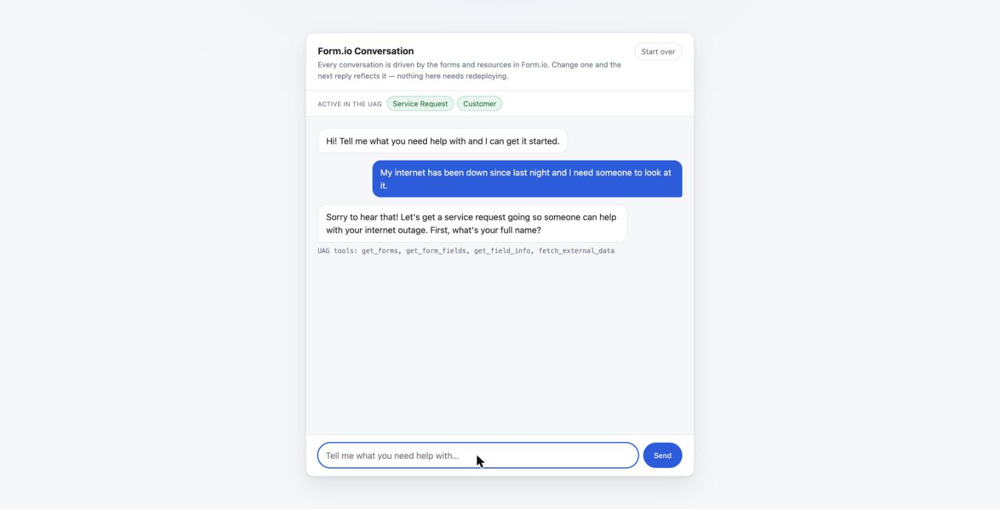
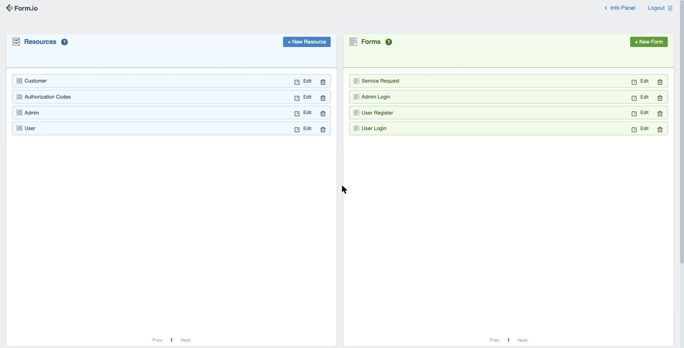
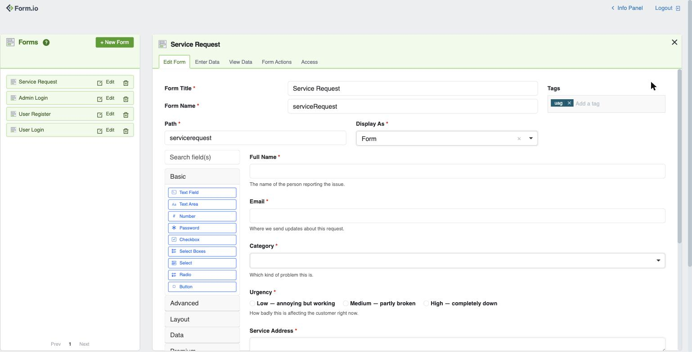
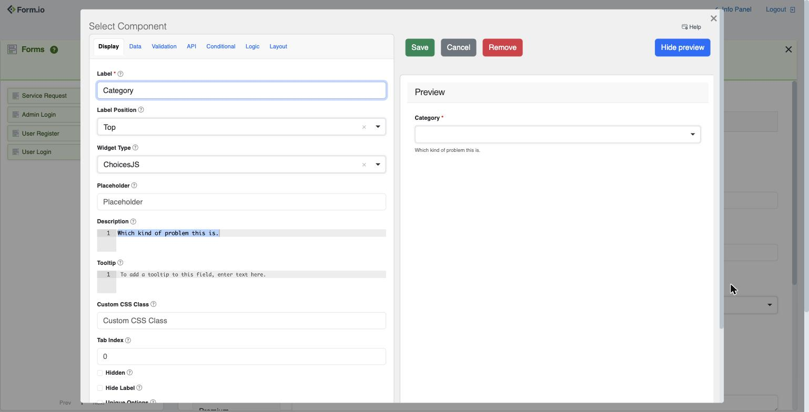
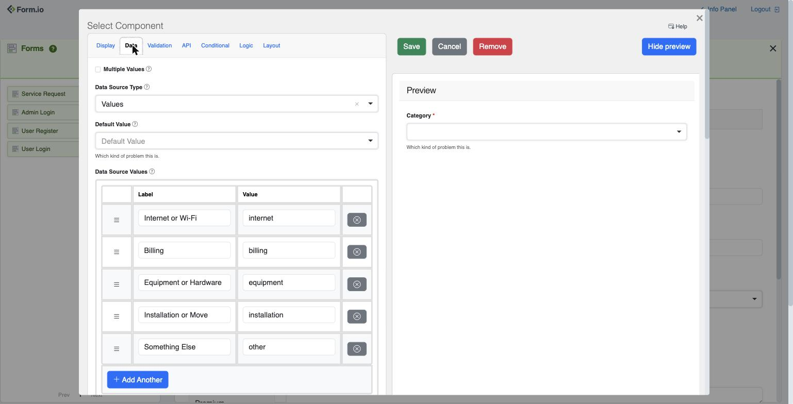
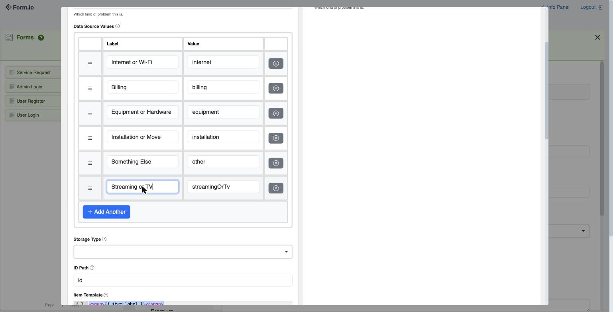
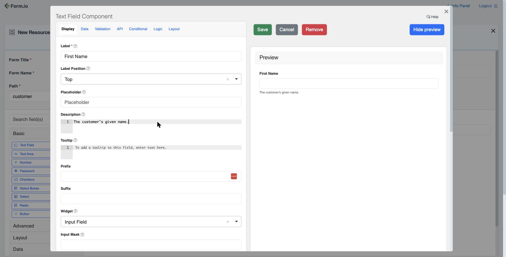
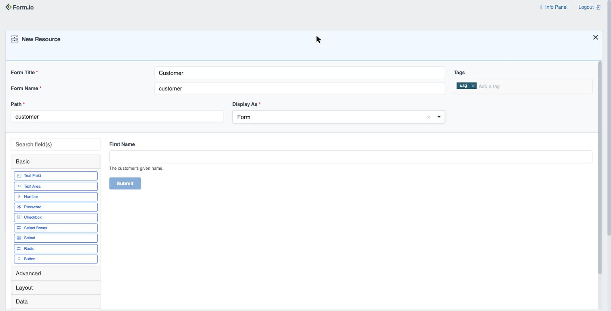
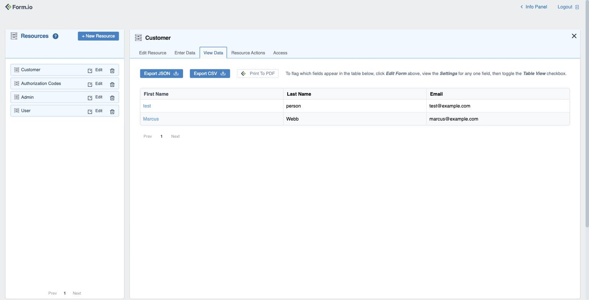

# Example: Conversation Form

<sub>[Form.io UAG](../../README.md) &rsaquo; this page</sub>

A chat application where **the form is the script**. A customer types "my internet has been down since last night" and an agent works out which form applies, what it still needs, which answers are valid, and when it has enough to submit — all by reading the form JSON through the UAG.

The chat server in this example is about 200 lines and contains no domain knowledge whatsoever. It never names a field, never lists the urgency options, never validates an email address. Search [`chat/server.js`](./chat/server.js) for "urgency" or "email" and you will not find them. Change the form and the conversation changes with it, with no redeploy and no prompt editing.

This example runs on [Form.io Community Edition](https://github.com/formio/formio), so no license or subscription is required.

> Want the *autonomous* pattern instead — a submission that an agent scores and decides on with no human present? See [examples/agentic-workflow](../agentic-workflow).
>
> Want to drive your forms from Claude Desktop rather than your own UI? See [examples/custom-module](../custom-module).

## How it fits together

```
browser  ──►  chat server  ──►  UAG  ──►  Form.io
   UI          MCP client       tools      forms + submissions
               + Claude API
```

The chat server holds the conversation history and runs the tool-use loop itself. It connects *out* to the UAG, so the UAG needs no public address and no tunnel — see [How Agents Connect](../../README.md#how-agents-connect). The Anthropic API only ever receives outbound requests carrying tool schemas and tool results.

## Pre-requisites

- **Docker** — https://www.docker.com
- **An Anthropic API key** — https://console.anthropic.com. A full conversation costs well under a cent.

## Running it

```bash
cp .env.example .env       # then edit .env and add your Anthropic API key
docker compose up -d --build
```

First boot takes about 30 seconds while Form.io initializes its database and the UAG installs the `serviceRequest` form from [`module/project.json`](./module/project.json).

Then open **http://localhost:3400** and start typing.



The green row under the header lists every form and resource the agent can currently see. That list is not hard-coded — the page asks the UAG through `get_forms` and refreshes every ten seconds, so it shows exactly what the agent sees. If something you just tagged does not appear there, the agent cannot see it either.

A conversation looks like this:

> **You:** My internet has been down since last night and I need someone to look at it.
> **Assistant:** That sounds frustrating! I can get a service request started for you. Could I get your full name?
> **You:** I'm Marcus Webb, marcus.webb@example.com. It is completely down, nothing works.
> **Assistant:** Got it, thanks Marcus. I've marked this as high urgency since your service is completely down. What's the street address where the service is installed?

Note what happened in that third message: one sentence filled in `fullName`, `email`, and `urgency`, and "completely down, nothing works" was mapped to the form's `high` option rather than stored as prose. Under each assistant reply the UI prints which UAG tools were called, so you can watch the form being read and the answers being checked.

When the conversation finishes you have a real submission. Look at it in the portal at http://localhost:3000 (`admin@example.com` / `CHANGEME`) under **Service Request → Submissions**.

Shut down and discard everything with:

```bash
docker compose down -v
```

## The experiment worth running

This is the part that makes the point, and you do it in the Form.io portal rather than in code. Open **http://localhost:3000** (`admin@example.com` / `CHANGEME`). The left column lists Resources, the right lists Forms — `Service Request` is the form this chat is driven by.



Nothing below requires editing a file, rebuilding an image, or restarting a container. The UAG re-reads the project every `PROJECT_TTL` seconds — 10 in this example — so a saved change reaches the conversation within about ten seconds.

### Changing an existing form

Click **Edit** next to `Service Request`. This is the form builder: the palette on the left, the form in the middle, and the form's settings across the top. Note the **Tags** box in the top right — `uag` is what makes this form visible to the agent at all.



Hover any field and click the gear icon to open its settings. The **Label** is what the customer sees; the **Description** is context the agent reads when deciding how to ask:



For a choice field, the **Data** tab holds the exact values the agent is allowed to use. This is where "what may this answer be?" is actually defined:



Click **Add Another**, type `Streaming or TV` as the label — the value fills itself in — then **Save** the component and **Save Form** at the bottom of the builder:



Wait about ten seconds, start a new conversation, and say your TV service is out. The assistant now offers the new category, because `get_field_info` returned it. Nothing about the chat application changed.

Other changes worth trying, all in the same place:

- **Add a field.** Drag a **Text Field** into the form, label it `Account Number`, and under **Validation** set it required with the pattern `^[0-9]{8}$`. The assistant starts asking for it and rejects `12345`.
- **Make something optional.** Open `Service Address` → **Validation** → untick **Required**. The assistant stops insisting on it.
- **Rewrite a description.** Sharpen the wording on any field and watch how differently the question gets asked. The description is agent context as much as human help text.

### Adding a new resource

The agent picks up anything in the project that carries the `uag` tag, not just the form shipped with this example. To prove it, add a `Customer` resource.

Click **+ New Resource**, set the **Form Title** to `Customer` — the name and path fill themselves in — and add `uag` to the **Tags** box. Then drag in the fields you want, giving each a description. Below, a `First Name` text field with the description the agent will read:



Add `Last Name` and `Email` the same way, then click **Create Resource**. The finished definition looks like this — title, name, path, the `uag` tag, and the fields:



> **The `uag` tag is the whole trick.** Without it the resource is invisible: the agent will insist the form does not exist, and no error appears anywhere. Watch the green row at the top of the chat — if your new resource is not listed there within ten seconds, the tag is missing.

Give it ten seconds, then open the chat and say *"I'd like to add a new customer — Marcus Webb, marcus@example.com"*. The assistant discovers the resource, asks for whatever it still needs, and submits it. You never told the chat application that customers exist.

The records land under the resource's **View Data** tab:



### If you would rather work in code

[`module/project.json`](./module/project.json) is the same project as a template, applied on boot. Editing it is a reasonable way to keep changes in version control, but it is not the fast feedback loop: the template is only applied when `formio-uag` starts, so a change there needs `docker compose restart formio-uag`. Portal edits win for experimenting; the template wins for anything you want reproducible.

## How the chat server works

Four things, all in [`chat/server.js`](./chat/server.js):

**1. It gets a token.** There is no browser in the loop, so it uses the `client_credentials` grant rather than the OAuth flow. On Community Edition the project name is always `formio-oss`, and the UAG requires that prefix on the `client_id`:

```js
POST /auth/token
{ "grant_type": "client_credentials",
  "client_id": "formio-oss-x-admin-key",
  "client_secret": ADMIN_KEY }
```

A `404` here means `BASE_URL` is not set on the UAG — without it the authentication provider is never enabled. The token is cached until shortly before it expires.

**2. It connects an MCP client to the UAG** over streamable HTTP, passing that token as a bearer token, and calls `listTools()` to discover what is available.

**3. It runs the tool loop.** Send history to Claude; if the reply is `tool_use`, execute each call against the UAG and append the results; repeat until text comes back. Conversation history lives in a `Map` keyed by session id.

**4. Its system prompt describes a process, not a form.** This is the whole trick — the prompt says *which tools to use in what order* and *how to behave while asking*, and says nothing about service requests:

```
1. Call get_forms ... pick the one that matches what the customer wants.
2. Call get_form_fields for that form to learn exactly which fields it has.
3. Call get_field_info before asking about a field ...
4. Ask ONE question at a time ...
```

The tools it leans on, in the order a conversation tends to use them:

| Tool | Role in the conversation |
|---|---|
| `get_forms` | Which forms exist — only `uag`-tagged ones are returned. |
| `get_form_fields` | What this form needs, and each field's data path. |
| `get_field_info` | Type, required-ness, validation rules, and the exact allowed values for choice fields. |
| `collect_field_data` | Records answers as they arrive, including several fields from one sentence. |
| `confirm_form_submission` | Produces the summary shown back to the customer before submitting. |
| `submit_completed_form` | Creates the actual submission. |

## Caveats before you build on this

- **Sessions are in memory.** Restarting the chat container forgets every conversation. Persist them somewhere real if you need continuity.
- **The chat acts as an administrator.** It authenticates with `ADMIN_KEY`, so the agent can see and write anything in the project. That is deliberate for a single-form demo and wrong for a multi-tenant one: authenticate each *user* instead, so the UAG applies that user's roles and permissions to every tool call. [examples/custom-module](../custom-module) shows a project where role-based permissions decide what the agent may do.
- **No spend controls.** Each turn is a full tool loop. Add per-session rate limiting before exposing anything like this publicly.
- **Replies are rendered as markdown from the CDN.** The page loads [marked](https://marked.js.org) and [DOMPurify](https://github.com/cure53/DOMPurify) from jsDelivr with subresource-integrity hashes. `marked` does not sanitize on its own, and the text being rendered comes from a model, so every reply is passed through DOMPurify before it touches the DOM. With no network the two scripts simply do not load and replies fall back to plain text — never to unsanitized HTML. Vendor the two files into `chat/public/` if you need it to work offline.
- **The model still writes the prose.** The form constrains *what is collected and what is valid*; it does not constrain tone. Keep the summary-and-confirm step so a human approves the data before it is written.
- **`ADMIN_KEY`, `JWT_SECRET`, and the Mongo secrets are all `CHANGEME`.** Change them for anything beyond a local demo.

## Troubleshooting

| Symptom | Cause |
|---|---|
| `docker compose up` fails with `set CLAUDE_API_KEY in .env` | You have not created `.env` yet. Copy `.env.example`. |
| The assistant says it cannot find a form | The form lost its `uag` tag, or the project cache has not refreshed. `docker compose restart formio-uag`. |
| Every turn errors with a token message | `BASE_URL` is unset on the UAG, or `ADMIN_KEY` differs between the `formio`, `formio-uag`, and `chat` services — all three must match. |
| The chat container exits at startup | It cannot reach the UAG. Check `docker compose logs formio-uag`; on a slow first boot the UAG waits for the server healthcheck. |
| A change you saved in the portal has not taken effect | Give it `PROJECT_TTL` seconds (10 here). If it still has not, confirm you clicked **Save Form** and not just **Save** on the component. |

For anything else, start with the [Troubleshooting section](../../README.md#troubleshooting) in the main Readme.
