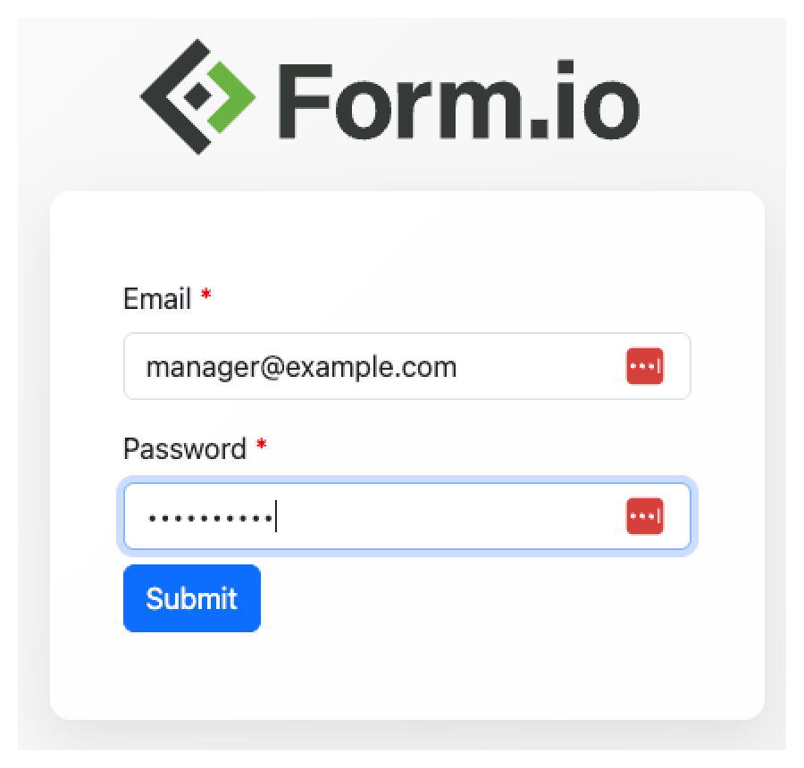
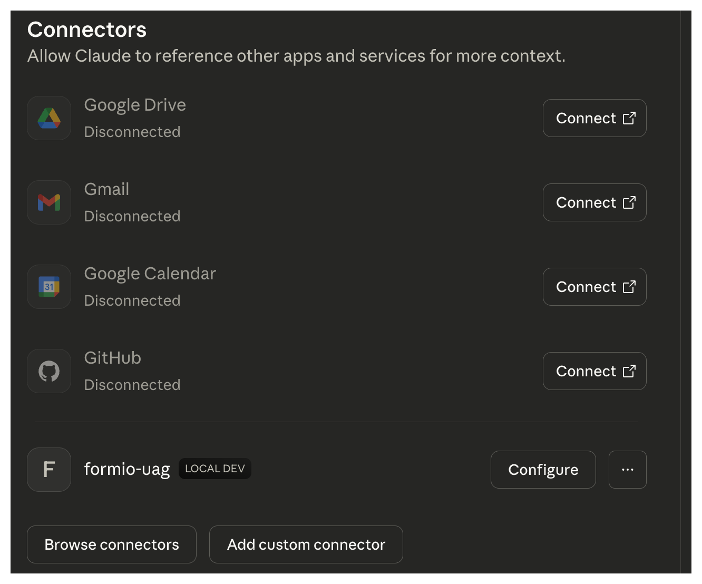
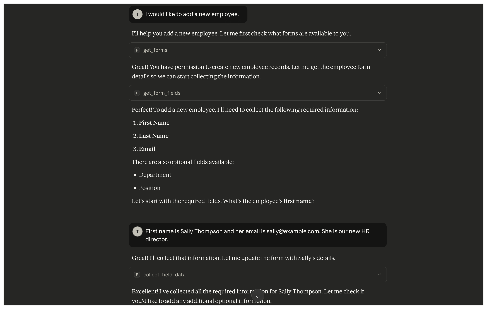
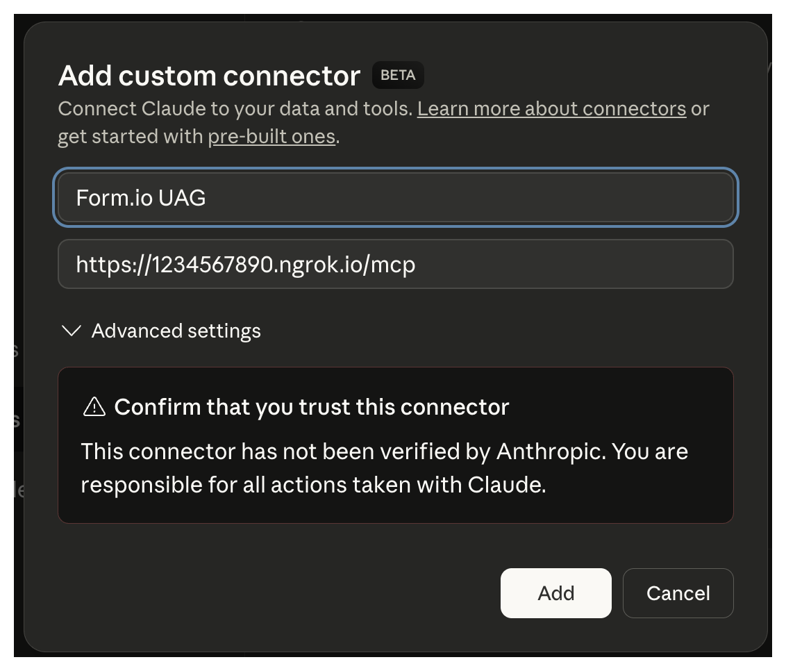

## Example UAG Module
This demonstrates how you can create your own custom modules to produce customized agent behaviors through the introduction of new Forms, Resources, Actions, and Configurations. This particular example, provides Employee's and Customers to an AI Agent where you can both onboard new Employees, and then they in turn can onboard new Customers.

## Pre-requisites
To run this example, there are a few things that you will need to have ready to go.

 - **Node.js**: Make sure that your machine has the latest LTS of Node.js installed. Go to https://nodejs.org/en/download to ensure that your machine has Node installed.
 - **Docker**: Go to https://www.docker.com and follow the instructions to install Docker on the machine you are running the example from.
 - **AI Agent with MCP support**:  The Form.io UAG requires that you utilize an AI Agent with Remote MCP support. We have done extensive testing using Claude (and we recomment it), but there may be other agents on the market that also provide a way to connect to custom Remote MCP endpoints. For this example, we will be leveraging **Claude Desktop** since it supports locally running MCP servers with its Free plan. To complete this example, you will need to download and install the **Claude Desktop** found @ https://claude.ai/download 

If you are using an AI Agent that only supports Remote MCP, you will also need to use a tool such as (NGROK) to create a secure web-accessible tunnel to your locally running server. For this example, however we will connect Claude to our locally running server using the Claude Desktop.

## Running the example
To run the example, you will first need to change the password that is found within the docker-compose.yml file. Any text that says CHANGEME, change this to a secure password. You should also take note of the urls provided to the **BASE_URL** and the **LOGIN_FORM** environment variables. If you are publishing this via a web-accessible url, or if you are using NGROK, then you will need to make sure that these variables change to the URL that your UAG is published. For now, we will just keep the urls set to ***http://localhost:3000***.

Once you have modified the docker-compose.yml file, you can spin up the local UAG by typing the following.

```
docker compose up -d
```

This will run the Form.io Community Edition server and MongoDB Community Edition locally while connecting the Form.io UAG to these systems. Once this is running, you can navigate to the following localhost url.

http://localhost:3000

From here, you can navigate to that URL and you should see the OSS Portal where you can login using the credentials:

  - Email: admin@example.com
  - Password: [YOUR PASSWORD]

Once logged in, you should see the Resources automatically created by the Module, which for this example is a **Customer** resource and an **Employee** resource. You will also see in the project an **Employee Login** form. This will allow you to add new "employees" that will have certain permissions to perform certain tasks. In this example, the Managers can onboard new Employees, and the Employees can onboard new "Customers".  If an "Employee" (non-manager) tries to create a new Employee, they should be rejected. This examples shows how you can create a project structure where certain users can do certain things with the AI Agent based on their permissions. To show how this works, we will first need to create an example Manager and an example Customer.

## Creating Manager and Employee
To create a new Manager, you simply need to click on the **Employee** resource within the Form.io OSS portal. You will then click on the **Enter Data** tab. On this resource you will provide an **Email**, a temporary **Password** and then make sure to select a **Role** for that employee and then click submit. For this example, lets create a Manager and Employee with the following.

 - Manager:
   - First Name: Example
   - Last Name: Manager
   - Email: manager@example.com
   - Role: Manager
   - Password: [TEMP PASSWORD]
 - Employee:
   - First Name: Example
   - Last Name: Employee
   - Email: employee@example.com
   - Role: Employee
   - Password: [TEMP PASSWORD]

After you create these records, you will now be ready to hook up your AI Agent to walk through creating both new Employees (if you are logged in as a Manager) and Customers (if you are logged in as an Employee). As you are using the AI Agent in the next step, you can verify that the data is being collected correctly by clicking on the data tab of that resource and clicking refresh as it does its thing. So, let's do that now!

## Connecting to an AI Agent
Now that you have the server running and the resources created, the next step is to connect our running UAG server with **Claude Desktop**.

However, before we launch Claude, we will first need to ensure that our locally running UAG server can connect to a local proxy called "mcp-remote".  To do this, we will need to authenticate so that it has the correct credentials when making requests to the UAG. To do this, we will first open up your Terminal, and run the following command.

```
npx mcp-remote http://localhost:3000/mcp
```

This will then navigate to a login page.

<div align="center">
  
</div>

Here you will then provide the one of the two user credentials that you configured in a previous step.  For example, we can login as the Manager using the following. After it logs in, it should then automatically be connected to the mcp-remote proxy, which is necessary to connect the **Claude Desktop** to your locally running UAG server.

If for any reason, you wish to log in as a different user, you can reset the "mcp-remote" authentication by deleting the ".mcp-auth" folder as follows. You can do this if you wish to try out the AI Agent logged in as either a Manager or an Employee.

```
rm -rf ~/.mcp-auth
```

Next, we will open up the **Claude Desktop**, where we will click on the **Developer** application bar item and then click on **Open App Config File**.  This should open up the ***claude_desktop_config.json*** file, which is used to configure locally ran MCP servers. We need to add an entry to run the "mcp-remote" proxy to call our lcoally running UAG server. We can do this by setting this file to read as follows.

```json
{
  "mcpServers": {
    "formio-uag": {
      "command": "npx",
      "args": [
        "mcp-remote",
        "http://localhost:3000/mcp"
      ]
    }
  }
}
```

We then need to close and re-open Claude Desktop.

Once you have re-opened Claude Desktop, you can then click on User | Settings, where you will see the following under the Connections section.

<div align="center">
  
</div>

You are now connected!

## Using the UAG

Once a UAG is connected to your Agent, it should now be aware of any Forms and Resources in your project that have the Tag **uag**.  In this example, these are the Customer and Employee resources. 

To engage with the UAG, simply open up a Chat window and say things such as the following...

 - "I would like to add a new Customer"
 - "I met a customer the other day... his name is Joe Smith and he is the CFO for Acme Inc."
 - "What is the phone number of my custom whos name is Joe Smith?"
 - "I ran into Joe Smith, who is already a customer. I need to add a note to call him next Tuesday".

The point of this module is that you can now use natural language to engage with the deterministic models created by the Form.io forms and resources. 

It should also be noted that if you are using the **Remote MCP** (described at the bottom section), then you can leverage this capability with the Mobile Application where you can use Voice prompts to engage with your Forms and Resources!
  
Here is an example of a real chat made with Claude AI connected to the UAG.

<div align="center">
  
</div>

From this point forward, the AI Agent will use your configured Form.io Resources as a "rule book" for the AI Agent to follow. It will fetch a list of forms, determine if you have permissions, fetch the necessary fields, and then determine how to properly engage with the human interfacing it. This is a similar effect to if you were engaging with a fully trained AI Agent connected to a bespoke dataset, only this time, the training is done dynamically using the power of Form.io!


### Claude Remote MCP Configurations
If you have upgrade your Claude to Pro level, or have onboarded your Enterprise through the Claude Enterprise Plan, you will want to deploy the UAG to a remote server with a Public URL. Once you do this, you will connect to the UAG through the Remote MCP connectors within the Claude AI portal.  To do this, we will open up Claude, and go to the "Connectors" section in the Settings and then click "Add Custom Connector". We will then need to provide the following.

 - Name:  Form.io UAG
 - Remote MCP Server URL:   <Your publically hosted URL for UAG>

<div align="center">
  
</div>

Now click "Add".

Once the Remote Connector has been established, you then need to click on the "Connect" button next to the "Form.io UAG" connector.  This will then navigate to a login page.

<div align="center">
  
</div>

Here you will then provide the one of the two user credentials that you configured in a previous step.  For example, we can login as the Manager using the following. After it logs in, it should then automatically redirect you back to the Claude UI, where you are now "Connected". 