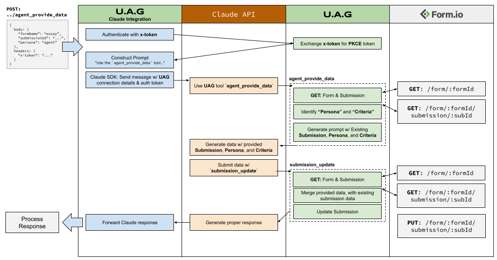
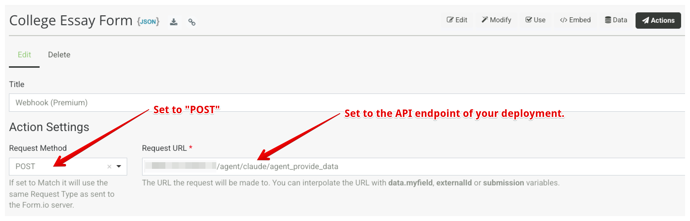
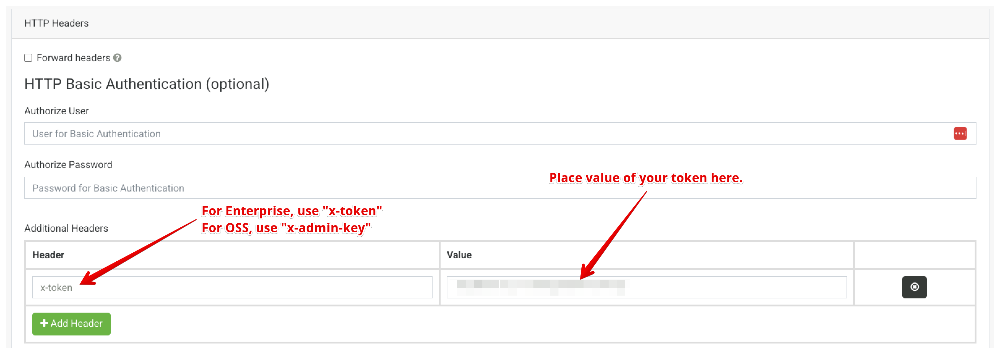
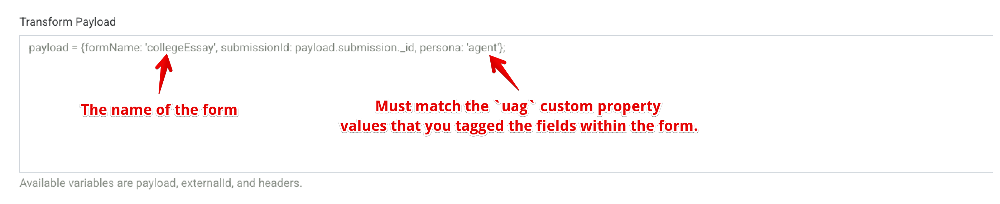

## Form.io UAG: Claude Integration

The Claude Integration for UAG provides a number of API endpoints that produce commands for the Claude API that directly use a UAG tool to perform AI Agentic automation procedures. This provides the ability to deploy the UAG along with this integration, and then trigger any tool from a Form.io Webhook. By default, this integration offers a few API commands, but this can be easily configured by overriding the "command" directory within the deployed Docker container. To get an understanding of how this process works in conjunction with the Claude API and the UAG, the following "flow" diagram helps to visualize the flow of communication between Claude, the UAG, and the Form.io Platform.



Following this diagram, we can see the following process:

 - UAG is deployed connected to a Form.io project, or an OSS deployment. Forms tagged with "uag" are made available to the UAG. It needs to be web accessible.
 - This integration server is also deployed alongside of the UAG, and is made web-accessible. See documentation below on how to deploy.
 - A POST request is then made to `/agent/claude/agent_provide_data` that contains the metadata that is handed to the `agent_provide_data.js` file within the "commands" folder. See documentation below on how to add new commands.
 - The command is then sent to the **Claude API** along with the connection details for the **UAG**.
 - The Agent then uses the UAG, which serves as an orchestrator for the AI Agentic behaviors.
 - The response from the Agent is then provided back to the response of the API and is then forwarded to the client.

## Instructions
There are two ways to run this integration: Locally via **Node.js** or with **Docker**.

### Running with Node.js
First, you will need to ensure you have **Node.js** installed on your machine, and then run the following within the `integrations/claude` directory.

```
npm install
```

Next, copy the `.env.example` file and paste it as file named `.env`. Inside this file, you will provide the [**Environment Variables**](#environment-variables) needed to run this integration. Once you have these environment variables configured, you can run the Node.js integration using the following.

```
node index.js
```

### Running with Docker
To run this integration, you will launch the `formio/uag-claude` docker container as follows.

```
docker run -d \
  -e "UAG_SERVER=https://uag.mysite.com" \
  -e "PROJECT_KEY=CHANGEME" \
  -e "CLAUDE_MODEL=claude-sonnet-4-5" \
  -e "CLAUDE_MAX_TOKENS=10000" \
  -e "CLAUDE_API_KEY=sk-ant-api03-..." \
  -e "PORT=3300" \
  --restart unless-stopped \
  --network formio \
  --name formio-uag \
  -p 3300:3300 \
  formio/uag-claude
```

Of course, this can also be utilized within a **Docker Compose** environment or any other Docker orchestration systems.

## Commands
Once the service is running, it will mount a series of **commands** at the following API endpoint `/agent/claude`. Each command name follows that API path, i.e. `/agent/claude/agent_provide_data`.  The following commands are available to be utilized.

| Command | Description |
|----------|-------------|
| `agent_provide_data` | Use an AI Agent to analyze a submission, and based on the configured **Persona** and **Criteria**, produce its own data to suppliment the submission. |
| `collect_field_data` | Provided a block of natual language text as well as a **Form Name**, this command is capable of retrieving a structured JSON submission data from that block of text. The results are returned as JSON. |

### agent_provide_data
This command instigates the Agent to use the `agent_provide_data` UAG tool in order to produce its own data provided an existing submission within a form. Within the Form JSON, there also exists some special fields that are capable of providing the **Persona** and **Criteria** for evaluation.  The following code block provides a description of how to use this command.

```json
{
    "method": "POST",
    "url": "/agent/claude/agent_provide_data",
    "body": {
        /**
         * The "name" of the form that the submission is submitted
         * against. This form should also contain a "uag" section 
         * that provides the "Persona" and the "Criteria" in order
         * to understand how to interpret the following submission.
         */
        "formName": "essay",

        /**
         * The _id of the submission that will be analyzed according
         * to the "Persona" and "Criteria" from the provided form.
         */
        "submissionId": "...",

        /**
         * (optional) This is the "persona" flag that is used to target
         * different personas within the provided form. This allows a
         * single form submission to have multiple AI Agentic personas
         * analyze this data according to different "Criteria"
         */
        "persona": "..."
    },
    "headers": {
        /**
         * This is the Project API key
         */
        "x-token": "..."
    }
}
```

## Form.io Webhook Setup
Once you have created a form that supports the `agent_provide_data` tool (see the main Readme for these instructions), you can configure a Webhook action so that this API is automatically triggered for that submission. The result of this approach, is that you can trigger an AI Agent to read a submission, analyze it according to the **Criteria** content, and then update that submission with its own provided data automatically. This would allow the creation of Agentic Workflows, where different Agents following different rules are capable of updating submissions with supplimental information, thus triggering other Webhooks if necessary. 

To setup a Webhook Action to leverage this API, you first need to establish the API endpoint as follows.



Once you have the webhook endpoint configured, the next objective is to set the Headers to include an **API Key** for your project.



Next, you now need to simply transform the Webhook payload so that is matches the body shown above, this can be done using the following code within the transform section.

```
payload = {formName: 'collegeEssay', submissionId: payload.submission._id, persona: 'agent'};
```

Make sure that you provide the correct formName and "persona" that matches the `uag` custom properties that you added to your form.



Finally, you will then just remove the `Delete` method from the **Methods** since you do NOT wish to fire this webhook when a submission is deleted (since the purpose is to suppliment submission data of an existing submission).


## Environment Variables
The following environment variables are used to configure the Claude Integration.

| Variable | Description | Example |
|----------|-------------|---------|
| UAG_SERVER | The "public" API Endpoint to the deployed UAG Server. NOTE: If you do not provide this value, and already have a BASE_URL enviornment variable set, this server will use that as the UAG_SERVER. | https://uag.mysite.com |
| PROJECT_KEY | (Enterprise Only) The Project's API Key | CHANGEME |
| ADMIN_KEY | (OSS Only) The Form.io OSS ADMIN_KEY | CHANGEME |
| CLAUDE_MODEL | The model within Claude to use when performing the Agentic analysis | claude-sonnet-4-5 |
| CLAUDE_MAX_TOKENS | The maximum amount of tokens to allow for the Agentic process to occur. | 10000 |
| CLAUDE_API_KEY | The API Key for the Claude API | sk-ant-api03-... |
| PORT | The port to run this integration server on. | 3300 |
